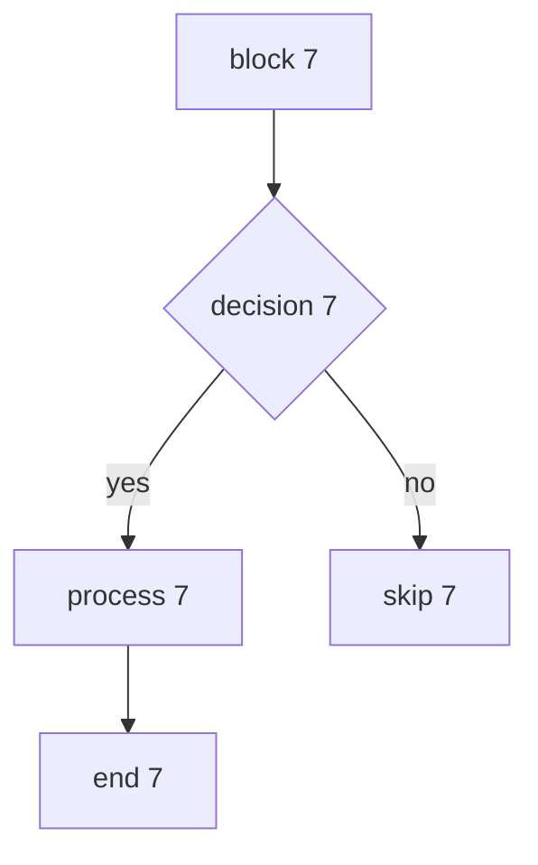
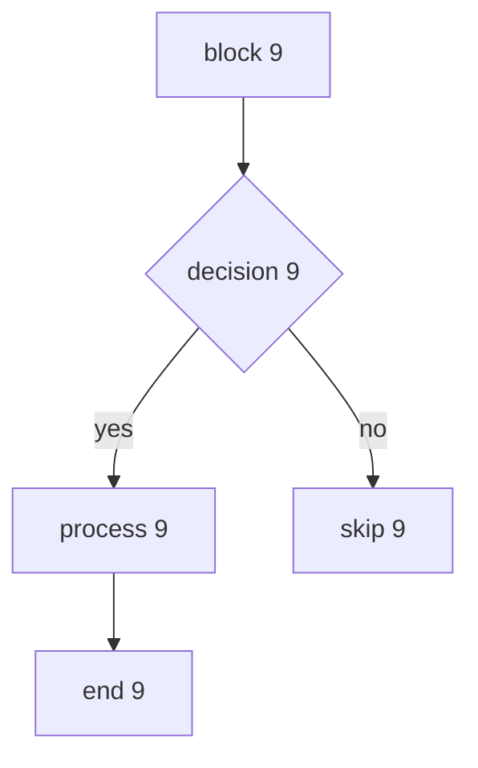
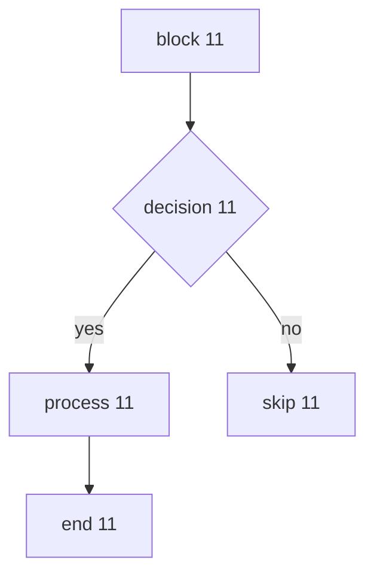
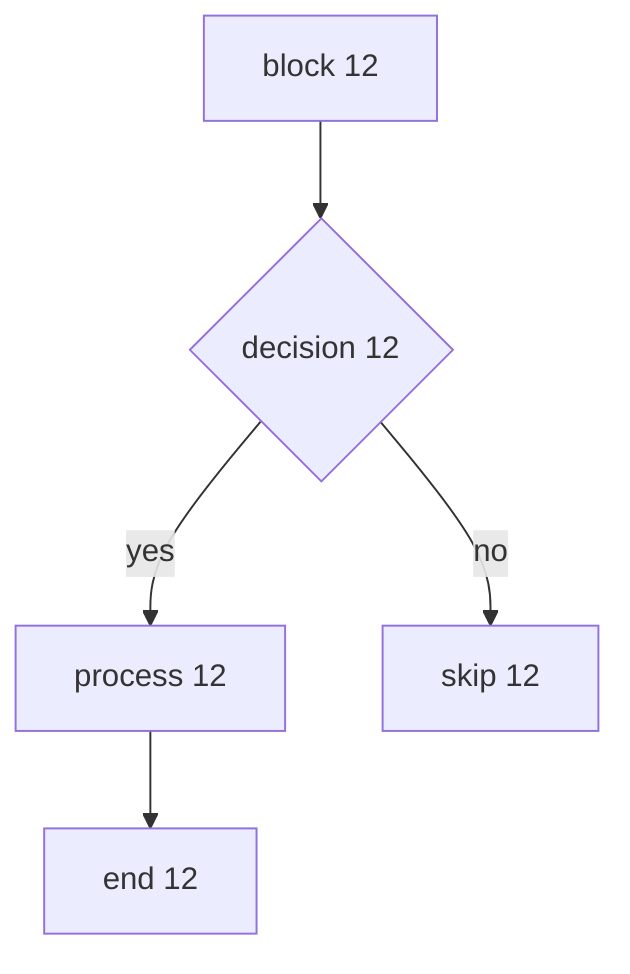

# Large-document performance fixture (demo-large)

> Auto-generated performance baseline fixture for the markflow preview refactor. Covers three optimization paths:
>
> - **D-E (Mermaid cache + lazy render)**: this section has 60 diagrams (including duplicates to verify hash-cache hits).
> - **R9 (local image intrinsic-size backfill)**: has 60 local images (`appdoc://`, triggers the `documents:image-size` IPC).
> - **D-D (block-level incremental render)**: has 100 varied sections, stressing parse and block cache.
> - **Export lang (<html lang>)**: frontmatter sets `lang: en`, covering the English-doc export path.

---

## Big-image jitter demo (R9 probe)

> The two local images below are 2000px tall, and their intrinsic size is not yet backfilled, so the first screen jumps in height noticeably;
> this is the root cause R9 aims to eliminate. The perf spec uses `cls` as the hard metric for R9.


## Feature coverage overview

| Feature           | Status | Notes                                                  |
| ----------------- | ------ | ------------------------------------------------------ |
| Standard Markdown | ✅     | headings, lists, links, images                         |
| GFM tables        | ✅     | header, alignment, cell embedding                      |
| Mermaid           | ✅     | flow / sequence / gantt / pie / state / class diagrams |
| Code highlight    | ✅     | multiple languages                                     |
| Math              | ✅     | inline and block                                       |
| Task lists        | ✅     | GFM checkboxes                                         |

### Task lists

- [x] completed example
- [x] another completed
- [ ] todo example
- [ ] another todo

### Math

inline: $E = mc^2$; block:

$$
\int_{0}^{\infty} e^{-x^2}\,dx = \frac{\sqrt{\pi}}{2}
$$

### Admonitions

!!! note "Note"
Local images should trigger intrinsic-size backfill to avoid first-screen height jumps.

!!! warning "Warning"
Remote images do not go through the image-size IPC — a known limitation.

### Blockquotes

> A good tool makes complex things simple.
>
> > This is a nested quote, used to test deep structure.

---

## Mermaid stress test (60)

> The first 20 are duplicates (to verify hash-cache hits); the rest are unique.

### Mermaid 1


### Mermaid 2


### Mermaid 3


### Mermaid 4


### Mermaid 5


### Mermaid 6


### Mermaid 7



### Mermaid 8


### Mermaid 9



### Mermaid 10


### Mermaid 11



### Mermaid 12



### Mermaid 13


### Mermaid 14


### Mermaid 15


### Mermaid 16


### Mermaid 17


### Mermaid 18


### Mermaid 19


### Mermaid 20


### Mermaid 21

```mermaid
graph TD
  A[block 21] --> B{decision 21}
  B -->|yes| C[process 21]
  B -->|no| D[skip 21]
  C --> E[end 21]
```

### Mermaid 22

```mermaid
sequenceDiagram
  participant U as user22
  participant S as system22
  U->>S: request 22
  S-->>U: response 22
  S->>S: internal processing 22
```

### Mermaid 23

```mermaid
gantt
  title task 23
  dateFormat YYYY-MM-DD
  section phase23
  design :a23, 2026-01-01, 3d
  develop :b23, after a23, 5d
  test :c23, after b23, 2d
```

### Mermaid 24

```mermaid
pie title distribution 24
  "A" : 50
  "B" : 50
  "C" : 20
```

### Mermaid 25

```mermaid
stateDiagram-v2
  [*] --> S1_25
  S1_25 --> S2_25 : event25
  S2_25 --> [*]
```

### Mermaid 26

```mermaid
classDiagram
  class C26 {
    +field26: number
    +method26()
  }
  C26 <|-- D26
```

### Mermaid 27

```mermaid
graph TD
  A[block 27] --> B{decision 27}
  B -->|yes| C[process 27]
  B -->|no| D[skip 27]
  C --> E[end 27]
```

### Mermaid 28

```mermaid
sequenceDiagram
  participant U as user28
  participant S as system28
  U->>S: request 28
  S-->>U: response 28
  S->>S: internal processing 28
```

### Mermaid 29

```mermaid
gantt
  title task 29
  dateFormat YYYY-MM-DD
  section phase29
  design :a29, 2026-01-01, 3d
  develop :b29, after a29, 5d
  test :c29, after b29, 2d
```

### Mermaid 30

```mermaid
pie title distribution 30
  "A" : 10
  "B" : 90
  "C" : 20
```

### Mermaid 31

```mermaid
stateDiagram-v2
  [*] --> S1_31
  S1_31 --> S2_31 : event31
  S2_31 --> [*]
```

### Mermaid 32

```mermaid
classDiagram
  class C32 {
    +field32: number
    +method32()
  }
  C32 <|-- D32
```

### Mermaid 33

```mermaid
graph TD
  A[block 33] --> B{decision 33}
  B -->|yes| C[process 33]
  B -->|no| D[skip 33]
  C --> E[end 33]
```

### Mermaid 34

```mermaid
sequenceDiagram
  participant U as user34
  participant S as system34
  U->>S: request 34
  S-->>U: response 34
  S->>S: internal processing 34
```

### Mermaid 35

```mermaid
gantt
  title task 35
  dateFormat YYYY-MM-DD
  section phase35
  design :a35, 2026-01-01, 3d
  develop :b35, after a35, 5d
  test :c35, after b35, 2d
```

### Mermaid 36

```mermaid
pie title distribution 36
  "A" : 20
  "B" : 80
  "C" : 20
```

### Mermaid 37

```mermaid
stateDiagram-v2
  [*] --> S1_37
  S1_37 --> S2_37 : event37
  S2_37 --> [*]
```

### Mermaid 38

```mermaid
classDiagram
  class C38 {
    +field38: number
    +method38()
  }
  C38 <|-- D38
```

### Mermaid 39

```mermaid
graph TD
  A[block 39] --> B{decision 39}
  B -->|yes| C[process 39]
  B -->|no| D[skip 39]
  C --> E[end 39]
```

### Mermaid 40

```mermaid
sequenceDiagram
  participant U as user40
  participant S as system40
  U->>S: request 40
  S-->>U: response 40
  S->>S: internal processing 40
```

### Mermaid 41

```mermaid
gantt
  title task 41
  dateFormat YYYY-MM-DD
  section phase41
  design :a41, 2026-01-01, 3d
  develop :b41, after a41, 5d
  test :c41, after b41, 2d
```

### Mermaid 42

```mermaid
pie title distribution 42
  "A" : 30
  "B" : 70
  "C" : 20
```

### Mermaid 43

```mermaid
stateDiagram-v2
  [*] --> S1_43
  S1_43 --> S2_43 : event43
  S2_43 --> [*]
```

### Mermaid 44

```mermaid
classDiagram
  class C44 {
    +field44: number
    +method44()
  }
  C44 <|-- D44
```

### Mermaid 45

```mermaid
graph TD
  A[block 45] --> B{decision 45}
  B -->|yes| C[process 45]
  B -->|no| D[skip 45]
  C --> E[end 45]
```

### Mermaid 46

```mermaid
sequenceDiagram
  participant U as user46
  participant S as system46
  U->>S: request 46
  S-->>U: response 46
  S->>S: internal processing 46
```

### Mermaid 47

```mermaid
gantt
  title task 47
  dateFormat YYYY-MM-DD
  section phase47
  design :a47, 2026-01-01, 3d
  develop :b47, after a47, 5d
  test :c47, after b47, 2d
```

### Mermaid 48

```mermaid
pie title distribution 48
  "A" : 40
  "B" : 60
  "C" : 20
```

### Mermaid 49

```mermaid
stateDiagram-v2
  [*] --> S1_49
  S1_49 --> S2_49 : event49
  S2_49 --> [*]
```

### Mermaid 50

```mermaid
classDiagram
  class C50 {
    +field50: number
    +method50()
  }
  C50 <|-- D50
```

### Mermaid 51

```mermaid
graph TD
  A[block 51] --> B{decision 51}
  B -->|yes| C[process 51]
  B -->|no| D[skip 51]
  C --> E[end 51]
```

### Mermaid 52

```mermaid
sequenceDiagram
  participant U as user52
  participant S as system52
  U->>S: request 52
  S-->>U: response 52
  S->>S: internal processing 52
```

### Mermaid 53

```mermaid
gantt
  title task 53
  dateFormat YYYY-MM-DD
  section phase53
  design :a53, 2026-01-01, 3d
  develop :b53, after a53, 5d
  test :c53, after b53, 2d
```

### Mermaid 54

```mermaid
pie title distribution 54
  "A" : 50
  "B" : 50
  "C" : 20
```

### Mermaid 55

```mermaid
stateDiagram-v2
  [*] --> S1_55
  S1_55 --> S2_55 : event55
  S2_55 --> [*]
```

### Mermaid 56

```mermaid
classDiagram
  class C56 {
    +field56: number
    +method56()
  }
  C56 <|-- D56
```

### Mermaid 57

```mermaid
graph TD
  A[block 57] --> B{decision 57}
  B -->|yes| C[process 57]
  B -->|no| D[skip 57]
  C --> E[end 57]
```

### Mermaid 58

```mermaid
sequenceDiagram
  participant U as user58
  participant S as system58
  U->>S: request 58
  S-->>U: response 58
  S->>S: internal processing 58
```

### Mermaid 59

```mermaid
gantt
  title task 59
  dateFormat YYYY-MM-DD
  section phase59
  design :a59, 2026-01-01, 3d
  develop :b59, after a59, 5d
  test :c59, after b59, 2d
```

### Mermaid 60

```mermaid
pie title distribution 60
  "A" : 10
  "B" : 90
  "C" : 20
```

## Image stress test (60 local + 1 remote)

> Local images resolve via `appdoc://`, triggering the `documents:image-size` IPC; the remote image is a control only.


---

## Chapter stress test (100 chapters)

### Chapter 1 · python example

This is the sample paragraph for chapter 1, used to stress block-level parsing and incremental rendering. Each chapter contains code, tables, lists, quotes and admonitions, simulating the structural variety of a real long document.

```python
def fn_1(n):
    """example 1"""
    return [x * 1 for x in range(n)]
```

| Metric   | Value  |
| -------- | ------ |
| Chapter  | 1      |
| Language | python |

- list item one (1)
- list item two
- list item three

> Quote from chapter 1.

!!! tip "Chapter tip 1"
This chapter uses python to demonstrate the cache-hit behaviour of block-level incremental rendering.

---

### Chapter 2 · javascript example

This is the sample paragraph for chapter 2, used to stress block-level parsing and incremental rendering. Each chapter contains code, tables, lists, quotes and admonitions, simulating the structural variety of a real long document.

```javascript
function fn2(n) {
  // example 2
  return Array.from({ length: n }, (_, x) => x * 2)
}
```

| Metric   | Value      |
| -------- | ---------- |
| Chapter  | 2          |
| Language | javascript |

- list item one (2)
- list item two
- list item three

> Quote from chapter 2.

!!! tip "Chapter tip 2"
This chapter uses javascript to demonstrate the cache-hit behaviour of block-level incremental rendering.

---

### Chapter 3 · typescript example

This is the sample paragraph for chapter 3, used to stress block-level parsing and incremental rendering. Each chapter contains code, tables, lists, quotes and admonitions, simulating the structural variety of a real long document.

```typescript
function fn3(n: number): number[] {
  // example 3
  return Array.from({ length: n }, (_, x) => x * 3)
}
```

| Metric   | Value      |
| -------- | ---------- |
| Chapter  | 3          |
| Language | typescript |

- list item one (3)
- list item two
- list item three

> Quote from chapter 3.

!!! tip "Chapter tip 3"
This chapter uses typescript to demonstrate the cache-hit behaviour of block-level incremental rendering.

---

### Chapter 4 · sql example

This is the sample paragraph for chapter 4, used to stress block-level parsing and incremental rendering. Each chapter contains code, tables, lists, quotes and admonitions, simulating the structural variety of a real long document.

```sql
SELECT id, name
FROM t_4
WHERE active = 1
ORDER BY id DESC
LIMIT 10;
```

| Metric   | Value |
| -------- | ----- |
| Chapter  | 4     |
| Language | sql   |

- list item one (4)
- list item two
- list item three

> Quote from chapter 4.

!!! tip "Chapter tip 4"
This chapter uses sql to demonstrate the cache-hit behaviour of block-level incremental rendering.

---

### Chapter 5 · bash example

This is the sample paragraph for chapter 5, used to stress block-level parsing and incremental rendering. Each chapter contains code, tables, lists, quotes and admonitions, simulating the structural variety of a real long document.

```bash
#!/bin/bash
# example 5
for f in docs/*.md; do
  echo "processing $f (5)"
done
```

| Metric   | Value |
| -------- | ----- |
| Chapter  | 5     |
| Language | bash  |

- list item one (5)
- list item two
- list item three

> Quote from chapter 5.

!!! tip "Chapter tip 5"
This chapter uses bash to demonstrate the cache-hit behaviour of block-level incremental rendering.

---

### Chapter 6 · go example

This is the sample paragraph for chapter 6, used to stress block-level parsing and incremental rendering. Each chapter contains code, tables, lists, quotes and admonitions, simulating the structural variety of a real long document.

```go
package main

import "fmt"

func fn6(n int) []int {
 out := make([]int, n)
 for x := 0; x < n; x++ {
  out[x] = x * 6
 }
 return out
}
```

| Metric   | Value |
| -------- | ----- |
| Chapter  | 6     |
| Language | go    |

- list item one (6)
- list item two
- list item three

> Quote from chapter 6.

!!! tip "Chapter tip 6"
This chapter uses go to demonstrate the cache-hit behaviour of block-level incremental rendering.

---

### Chapter 7 · rust example

This is the sample paragraph for chapter 7, used to stress block-level parsing and incremental rendering. Each chapter contains code, tables, lists, quotes and admonitions, simulating the structural variety of a real long document.

```rust
fn fn_7(n: usize) -> Vec<usize> {
    // example 7
    (0..n).map(|x| x * 7).collect()
}
```

| Metric   | Value |
| -------- | ----- |
| Chapter  | 7     |
| Language | rust  |

- list item one (7)
- list item two
- list item three

> Quote from chapter 7.

!!! tip "Chapter tip 7"
This chapter uses rust to demonstrate the cache-hit behaviour of block-level incremental rendering.

---

### Chapter 8 · json example

This is the sample paragraph for chapter 8, used to stress block-level parsing and incremental rendering. Each chapter contains code, tables, lists, quotes and admonitions, simulating the structural variety of a real long document.

```json
{
  "id": 8,
  "name": "item-8",
  "active": true
}
```

| Metric   | Value |
| -------- | ----- |
| Chapter  | 8     |
| Language | json  |

- list item one (8)
- list item two
- list item three

> Quote from chapter 8.

!!! tip "Chapter tip 8"
This chapter uses json to demonstrate the cache-hit behaviour of block-level incremental rendering.

---

### Chapter 9 · yaml example

This is the sample paragraph for chapter 9, used to stress block-level parsing and incremental rendering. Each chapter contains code, tables, lists, quotes and admonitions, simulating the structural variety of a real long document.

```yaml
task_9:
  name: example 9
  active: true
  retries: 3
```

| Metric   | Value |
| -------- | ----- |
| Chapter  | 9     |
| Language | yaml  |

- list item one (9)
- list item two
- list item three

> Quote from chapter 9.

!!! tip "Chapter tip 9"
This chapter uses yaml to demonstrate the cache-hit behaviour of block-level incremental rendering.

---

### Chapter 10 · java example

This is the sample paragraph for chapter 10, used to stress block-level parsing and incremental rendering. Each chapter contains code, tables, lists, quotes and admonitions, simulating the structural variety of a real long document.

```java
public List<Integer> fn10(int n) {
  // example 10
  List<Integer> out = new ArrayList<>();
  for (int x = 0; x < n; x++) out.add(x * 10);
  return out;
}
```

| Metric   | Value |
| -------- | ----- |
| Chapter  | 10    |
| Language | java  |

- list item one (10)
- list item two
- list item three

> Quote from chapter 10.

!!! tip "Chapter tip 10"
This chapter uses java to demonstrate the cache-hit behaviour of block-level incremental rendering.

---

### Chapter 11 · python example

This is the sample paragraph for chapter 11, used to stress block-level parsing and incremental rendering. Each chapter contains code, tables, lists, quotes and admonitions, simulating the structural variety of a real long document.

```python
def fn_11(n):
    """example 11"""
    return [x * 11 for x in range(n)]
```

| Metric   | Value  |
| -------- | ------ |
| Chapter  | 11     |
| Language | python |

- list item one (11)
- list item two
- list item three

> Quote from chapter 11.

!!! tip "Chapter tip 11"
This chapter uses python to demonstrate the cache-hit behaviour of block-level incremental rendering.

---

### Chapter 12 · javascript example

This is the sample paragraph for chapter 12, used to stress block-level parsing and incremental rendering. Each chapter contains code, tables, lists, quotes and admonitions, simulating the structural variety of a real long document.

```javascript
function fn12(n) {
  // example 12
  return Array.from({ length: n }, (_, x) => x * 12)
}
```

| Metric   | Value      |
| -------- | ---------- |
| Chapter  | 12         |
| Language | javascript |

- list item one (12)
- list item two
- list item three

> Quote from chapter 12.

!!! tip "Chapter tip 12"
This chapter uses javascript to demonstrate the cache-hit behaviour of block-level incremental rendering.

---

### Chapter 13 · typescript example

This is the sample paragraph for chapter 13, used to stress block-level parsing and incremental rendering. Each chapter contains code, tables, lists, quotes and admonitions, simulating the structural variety of a real long document.

```typescript
function fn13(n: number): number[] {
  // example 13
  return Array.from({ length: n }, (_, x) => x * 13)
}
```

| Metric   | Value      |
| -------- | ---------- |
| Chapter  | 13         |
| Language | typescript |

- list item one (13)
- list item two
- list item three

> Quote from chapter 13.

!!! tip "Chapter tip 13"
This chapter uses typescript to demonstrate the cache-hit behaviour of block-level incremental rendering.

---

### Chapter 14 · sql example

This is the sample paragraph for chapter 14, used to stress block-level parsing and incremental rendering. Each chapter contains code, tables, lists, quotes and admonitions, simulating the structural variety of a real long document.

```sql
SELECT id, name
FROM t_14
WHERE active = 1
ORDER BY id DESC
LIMIT 10;
```

| Metric   | Value |
| -------- | ----- |
| Chapter  | 14    |
| Language | sql   |

- list item one (14)
- list item two
- list item three

> Quote from chapter 14.

!!! tip "Chapter tip 14"
This chapter uses sql to demonstrate the cache-hit behaviour of block-level incremental rendering.

---

### Chapter 15 · bash example

This is the sample paragraph for chapter 15, used to stress block-level parsing and incremental rendering. Each chapter contains code, tables, lists, quotes and admonitions, simulating the structural variety of a real long document.

```bash
#!/bin/bash
# example 15
for f in docs/*.md; do
  echo "processing $f (15)"
done
```

| Metric   | Value |
| -------- | ----- |
| Chapter  | 15    |
| Language | bash  |

- list item one (15)
- list item two
- list item three

> Quote from chapter 15.

!!! tip "Chapter tip 15"
This chapter uses bash to demonstrate the cache-hit behaviour of block-level incremental rendering.

---

### Chapter 16 · go example

This is the sample paragraph for chapter 16, used to stress block-level parsing and incremental rendering. Each chapter contains code, tables, lists, quotes and admonitions, simulating the structural variety of a real long document.

```go
package main

import "fmt"

func fn16(n int) []int {
 out := make([]int, n)
 for x := 0; x < n; x++ {
  out[x] = x * 16
 }
 return out
}
```

| Metric   | Value |
| -------- | ----- |
| Chapter  | 16    |
| Language | go    |

- list item one (16)
- list item two
- list item three

> Quote from chapter 16.

!!! tip "Chapter tip 16"
This chapter uses go to demonstrate the cache-hit behaviour of block-level incremental rendering.

---

### Chapter 17 · rust example

This is the sample paragraph for chapter 17, used to stress block-level parsing and incremental rendering. Each chapter contains code, tables, lists, quotes and admonitions, simulating the structural variety of a real long document.

```rust
fn fn_17(n: usize) -> Vec<usize> {
    // example 17
    (0..n).map(|x| x * 17).collect()
}
```

| Metric   | Value |
| -------- | ----- |
| Chapter  | 17    |
| Language | rust  |

- list item one (17)
- list item two
- list item three

> Quote from chapter 17.

!!! tip "Chapter tip 17"
This chapter uses rust to demonstrate the cache-hit behaviour of block-level incremental rendering.

---

### Chapter 18 · json example

This is the sample paragraph for chapter 18, used to stress block-level parsing and incremental rendering. Each chapter contains code, tables, lists, quotes and admonitions, simulating the structural variety of a real long document.

```json
{
  "id": 18,
  "name": "item-18",
  "active": true
}
```

| Metric   | Value |
| -------- | ----- |
| Chapter  | 18    |
| Language | json  |

- list item one (18)
- list item two
- list item three

> Quote from chapter 18.

!!! tip "Chapter tip 18"
This chapter uses json to demonstrate the cache-hit behaviour of block-level incremental rendering.

---

### Chapter 19 · yaml example

This is the sample paragraph for chapter 19, used to stress block-level parsing and incremental rendering. Each chapter contains code, tables, lists, quotes and admonitions, simulating the structural variety of a real long document.

```yaml
task_19:
  name: example 19
  active: true
  retries: 3
```

| Metric   | Value |
| -------- | ----- |
| Chapter  | 19    |
| Language | yaml  |

- list item one (19)
- list item two
- list item three

> Quote from chapter 19.

!!! tip "Chapter tip 19"
This chapter uses yaml to demonstrate the cache-hit behaviour of block-level incremental rendering.

---

### Chapter 20 · java example

This is the sample paragraph for chapter 20, used to stress block-level parsing and incremental rendering. Each chapter contains code, tables, lists, quotes and admonitions, simulating the structural variety of a real long document.

```java
public List<Integer> fn20(int n) {
  // example 20
  List<Integer> out = new ArrayList<>();
  for (int x = 0; x < n; x++) out.add(x * 20);
  return out;
}
```

| Metric   | Value |
| -------- | ----- |
| Chapter  | 20    |
| Language | java  |

- list item one (20)
- list item two
- list item three

> Quote from chapter 20.

!!! tip "Chapter tip 20"
This chapter uses java to demonstrate the cache-hit behaviour of block-level incremental rendering.

---

### Chapter 21 · python example

This is the sample paragraph for chapter 21, used to stress block-level parsing and incremental rendering. Each chapter contains code, tables, lists, quotes and admonitions, simulating the structural variety of a real long document.

```python
def fn_21(n):
    """example 21"""
    return [x * 21 for x in range(n)]
```

| Metric   | Value  |
| -------- | ------ |
| Chapter  | 21     |
| Language | python |

- list item one (21)
- list item two
- list item three

> Quote from chapter 21.

!!! tip "Chapter tip 21"
This chapter uses python to demonstrate the cache-hit behaviour of block-level incremental rendering.

---

### Chapter 22 · javascript example

This is the sample paragraph for chapter 22, used to stress block-level parsing and incremental rendering. Each chapter contains code, tables, lists, quotes and admonitions, simulating the structural variety of a real long document.

```javascript
function fn22(n) {
  // example 22
  return Array.from({ length: n }, (_, x) => x * 22)
}
```

| Metric   | Value      |
| -------- | ---------- |
| Chapter  | 22         |
| Language | javascript |

- list item one (22)
- list item two
- list item three

> Quote from chapter 22.

!!! tip "Chapter tip 22"
This chapter uses javascript to demonstrate the cache-hit behaviour of block-level incremental rendering.

---

### Chapter 23 · typescript example

This is the sample paragraph for chapter 23, used to stress block-level parsing and incremental rendering. Each chapter contains code, tables, lists, quotes and admonitions, simulating the structural variety of a real long document.

```typescript
function fn23(n: number): number[] {
  // example 23
  return Array.from({ length: n }, (_, x) => x * 23)
}
```

| Metric   | Value      |
| -------- | ---------- |
| Chapter  | 23         |
| Language | typescript |

- list item one (23)
- list item two
- list item three

> Quote from chapter 23.

!!! tip "Chapter tip 23"
This chapter uses typescript to demonstrate the cache-hit behaviour of block-level incremental rendering.

---

### Chapter 24 · sql example

This is the sample paragraph for chapter 24, used to stress block-level parsing and incremental rendering. Each chapter contains code, tables, lists, quotes and admonitions, simulating the structural variety of a real long document.

```sql
SELECT id, name
FROM t_24
WHERE active = 1
ORDER BY id DESC
LIMIT 10;
```

| Metric   | Value |
| -------- | ----- |
| Chapter  | 24    |
| Language | sql   |

- list item one (24)
- list item two
- list item three

> Quote from chapter 24.

!!! tip "Chapter tip 24"
This chapter uses sql to demonstrate the cache-hit behaviour of block-level incremental rendering.

---

### Chapter 25 · bash example

This is the sample paragraph for chapter 25, used to stress block-level parsing and incremental rendering. Each chapter contains code, tables, lists, quotes and admonitions, simulating the structural variety of a real long document.

```bash
#!/bin/bash
# example 25
for f in docs/*.md; do
  echo "processing $f (25)"
done
```

| Metric   | Value |
| -------- | ----- |
| Chapter  | 25    |
| Language | bash  |

- list item one (25)
- list item two
- list item three

> Quote from chapter 25.

!!! tip "Chapter tip 25"
This chapter uses bash to demonstrate the cache-hit behaviour of block-level incremental rendering.

---

### Chapter 26 · go example

This is the sample paragraph for chapter 26, used to stress block-level parsing and incremental rendering. Each chapter contains code, tables, lists, quotes and admonitions, simulating the structural variety of a real long document.

```go
package main

import "fmt"

func fn26(n int) []int {
 out := make([]int, n)
 for x := 0; x < n; x++ {
  out[x] = x * 26
 }
 return out
}
```

| Metric   | Value |
| -------- | ----- |
| Chapter  | 26    |
| Language | go    |

- list item one (26)
- list item two
- list item three

> Quote from chapter 26.

!!! tip "Chapter tip 26"
This chapter uses go to demonstrate the cache-hit behaviour of block-level incremental rendering.

---

### Chapter 27 · rust example

This is the sample paragraph for chapter 27, used to stress block-level parsing and incremental rendering. Each chapter contains code, tables, lists, quotes and admonitions, simulating the structural variety of a real long document.

```rust
fn fn_27(n: usize) -> Vec<usize> {
    // example 27
    (0..n).map(|x| x * 27).collect()
}
```

| Metric   | Value |
| -------- | ----- |
| Chapter  | 27    |
| Language | rust  |

- list item one (27)
- list item two
- list item three

> Quote from chapter 27.

!!! tip "Chapter tip 27"
This chapter uses rust to demonstrate the cache-hit behaviour of block-level incremental rendering.

---

### Chapter 28 · json example

This is the sample paragraph for chapter 28, used to stress block-level parsing and incremental rendering. Each chapter contains code, tables, lists, quotes and admonitions, simulating the structural variety of a real long document.

```json
{
  "id": 28,
  "name": "item-28",
  "active": true
}
```

| Metric   | Value |
| -------- | ----- |
| Chapter  | 28    |
| Language | json  |

- list item one (28)
- list item two
- list item three

> Quote from chapter 28.

!!! tip "Chapter tip 28"
This chapter uses json to demonstrate the cache-hit behaviour of block-level incremental rendering.

---

### Chapter 29 · yaml example

This is the sample paragraph for chapter 29, used to stress block-level parsing and incremental rendering. Each chapter contains code, tables, lists, quotes and admonitions, simulating the structural variety of a real long document.

```yaml
task_29:
  name: example 29
  active: true
  retries: 3
```

| Metric   | Value |
| -------- | ----- |
| Chapter  | 29    |
| Language | yaml  |

- list item one (29)
- list item two
- list item three

> Quote from chapter 29.

!!! tip "Chapter tip 29"
This chapter uses yaml to demonstrate the cache-hit behaviour of block-level incremental rendering.

---

### Chapter 30 · java example

This is the sample paragraph for chapter 30, used to stress block-level parsing and incremental rendering. Each chapter contains code, tables, lists, quotes and admonitions, simulating the structural variety of a real long document.

```java
public List<Integer> fn30(int n) {
  // example 30
  List<Integer> out = new ArrayList<>();
  for (int x = 0; x < n; x++) out.add(x * 30);
  return out;
}
```

| Metric   | Value |
| -------- | ----- |
| Chapter  | 30    |
| Language | java  |

- list item one (30)
- list item two
- list item three

> Quote from chapter 30.

!!! tip "Chapter tip 30"
This chapter uses java to demonstrate the cache-hit behaviour of block-level incremental rendering.

---

### Chapter 31 · python example

This is the sample paragraph for chapter 31, used to stress block-level parsing and incremental rendering. Each chapter contains code, tables, lists, quotes and admonitions, simulating the structural variety of a real long document.

```python
def fn_31(n):
    """example 31"""
    return [x * 31 for x in range(n)]
```

| Metric   | Value  |
| -------- | ------ |
| Chapter  | 31     |
| Language | python |

- list item one (31)
- list item two
- list item three

> Quote from chapter 31.

!!! tip "Chapter tip 31"
This chapter uses python to demonstrate the cache-hit behaviour of block-level incremental rendering.

---

### Chapter 32 · javascript example

This is the sample paragraph for chapter 32, used to stress block-level parsing and incremental rendering. Each chapter contains code, tables, lists, quotes and admonitions, simulating the structural variety of a real long document.

```javascript
function fn32(n) {
  // example 32
  return Array.from({ length: n }, (_, x) => x * 32)
}
```

| Metric   | Value      |
| -------- | ---------- |
| Chapter  | 32         |
| Language | javascript |

- list item one (32)
- list item two
- list item three

> Quote from chapter 32.

!!! tip "Chapter tip 32"
This chapter uses javascript to demonstrate the cache-hit behaviour of block-level incremental rendering.

---

### Chapter 33 · typescript example

This is the sample paragraph for chapter 33, used to stress block-level parsing and incremental rendering. Each chapter contains code, tables, lists, quotes and admonitions, simulating the structural variety of a real long document.

```typescript
function fn33(n: number): number[] {
  // example 33
  return Array.from({ length: n }, (_, x) => x * 33)
}
```

| Metric   | Value      |
| -------- | ---------- |
| Chapter  | 33         |
| Language | typescript |

- list item one (33)
- list item two
- list item three

> Quote from chapter 33.

!!! tip "Chapter tip 33"
This chapter uses typescript to demonstrate the cache-hit behaviour of block-level incremental rendering.

---

### Chapter 34 · sql example

This is the sample paragraph for chapter 34, used to stress block-level parsing and incremental rendering. Each chapter contains code, tables, lists, quotes and admonitions, simulating the structural variety of a real long document.

```sql
SELECT id, name
FROM t_34
WHERE active = 1
ORDER BY id DESC
LIMIT 10;
```

| Metric   | Value |
| -------- | ----- |
| Chapter  | 34    |
| Language | sql   |

- list item one (34)
- list item two
- list item three

> Quote from chapter 34.

!!! tip "Chapter tip 34"
This chapter uses sql to demonstrate the cache-hit behaviour of block-level incremental rendering.

---

### Chapter 35 · bash example

This is the sample paragraph for chapter 35, used to stress block-level parsing and incremental rendering. Each chapter contains code, tables, lists, quotes and admonitions, simulating the structural variety of a real long document.

```bash
#!/bin/bash
# example 35
for f in docs/*.md; do
  echo "processing $f (35)"
done
```

| Metric   | Value |
| -------- | ----- |
| Chapter  | 35    |
| Language | bash  |

- list item one (35)
- list item two
- list item three

> Quote from chapter 35.

!!! tip "Chapter tip 35"
This chapter uses bash to demonstrate the cache-hit behaviour of block-level incremental rendering.

---

### Chapter 36 · go example

This is the sample paragraph for chapter 36, used to stress block-level parsing and incremental rendering. Each chapter contains code, tables, lists, quotes and admonitions, simulating the structural variety of a real long document.

```go
package main

import "fmt"

func fn36(n int) []int {
 out := make([]int, n)
 for x := 0; x < n; x++ {
  out[x] = x * 36
 }
 return out
}
```

| Metric   | Value |
| -------- | ----- |
| Chapter  | 36    |
| Language | go    |

- list item one (36)
- list item two
- list item three

> Quote from chapter 36.

!!! tip "Chapter tip 36"
This chapter uses go to demonstrate the cache-hit behaviour of block-level incremental rendering.

---

### Chapter 37 · rust example

This is the sample paragraph for chapter 37, used to stress block-level parsing and incremental rendering. Each chapter contains code, tables, lists, quotes and admonitions, simulating the structural variety of a real long document.

```rust
fn fn_37(n: usize) -> Vec<usize> {
    // example 37
    (0..n).map(|x| x * 37).collect()
}
```

| Metric   | Value |
| -------- | ----- |
| Chapter  | 37    |
| Language | rust  |

- list item one (37)
- list item two
- list item three

> Quote from chapter 37.

!!! tip "Chapter tip 37"
This chapter uses rust to demonstrate the cache-hit behaviour of block-level incremental rendering.

---

### Chapter 38 · json example

This is the sample paragraph for chapter 38, used to stress block-level parsing and incremental rendering. Each chapter contains code, tables, lists, quotes and admonitions, simulating the structural variety of a real long document.

```json
{
  "id": 38,
  "name": "item-38",
  "active": true
}
```

| Metric   | Value |
| -------- | ----- |
| Chapter  | 38    |
| Language | json  |

- list item one (38)
- list item two
- list item three

> Quote from chapter 38.

!!! tip "Chapter tip 38"
This chapter uses json to demonstrate the cache-hit behaviour of block-level incremental rendering.

---

### Chapter 39 · yaml example

This is the sample paragraph for chapter 39, used to stress block-level parsing and incremental rendering. Each chapter contains code, tables, lists, quotes and admonitions, simulating the structural variety of a real long document.

```yaml
task_39:
  name: example 39
  active: true
  retries: 3
```

| Metric   | Value |
| -------- | ----- |
| Chapter  | 39    |
| Language | yaml  |

- list item one (39)
- list item two
- list item three

> Quote from chapter 39.

!!! tip "Chapter tip 39"
This chapter uses yaml to demonstrate the cache-hit behaviour of block-level incremental rendering.

---

### Chapter 40 · java example

This is the sample paragraph for chapter 40, used to stress block-level parsing and incremental rendering. Each chapter contains code, tables, lists, quotes and admonitions, simulating the structural variety of a real long document.

```java
public List<Integer> fn40(int n) {
  // example 40
  List<Integer> out = new ArrayList<>();
  for (int x = 0; x < n; x++) out.add(x * 40);
  return out;
}
```

| Metric   | Value |
| -------- | ----- |
| Chapter  | 40    |
| Language | java  |

- list item one (40)
- list item two
- list item three

> Quote from chapter 40.

!!! tip "Chapter tip 40"
This chapter uses java to demonstrate the cache-hit behaviour of block-level incremental rendering.

---

### Chapter 41 · python example

This is the sample paragraph for chapter 41, used to stress block-level parsing and incremental rendering. Each chapter contains code, tables, lists, quotes and admonitions, simulating the structural variety of a real long document.

```python
def fn_41(n):
    """example 41"""
    return [x * 41 for x in range(n)]
```

| Metric   | Value  |
| -------- | ------ |
| Chapter  | 41     |
| Language | python |

- list item one (41)
- list item two
- list item three

> Quote from chapter 41.

!!! tip "Chapter tip 41"
This chapter uses python to demonstrate the cache-hit behaviour of block-level incremental rendering.

---

### Chapter 42 · javascript example

This is the sample paragraph for chapter 42, used to stress block-level parsing and incremental rendering. Each chapter contains code, tables, lists, quotes and admonitions, simulating the structural variety of a real long document.

```javascript
function fn42(n) {
  // example 42
  return Array.from({ length: n }, (_, x) => x * 42)
}
```

| Metric   | Value      |
| -------- | ---------- |
| Chapter  | 42         |
| Language | javascript |

- list item one (42)
- list item two
- list item three

> Quote from chapter 42.

!!! tip "Chapter tip 42"
This chapter uses javascript to demonstrate the cache-hit behaviour of block-level incremental rendering.

---

### Chapter 43 · typescript example

This is the sample paragraph for chapter 43, used to stress block-level parsing and incremental rendering. Each chapter contains code, tables, lists, quotes and admonitions, simulating the structural variety of a real long document.

```typescript
function fn43(n: number): number[] {
  // example 43
  return Array.from({ length: n }, (_, x) => x * 43)
}
```

| Metric   | Value      |
| -------- | ---------- |
| Chapter  | 43         |
| Language | typescript |

- list item one (43)
- list item two
- list item three

> Quote from chapter 43.

!!! tip "Chapter tip 43"
This chapter uses typescript to demonstrate the cache-hit behaviour of block-level incremental rendering.

---

### Chapter 44 · sql example

This is the sample paragraph for chapter 44, used to stress block-level parsing and incremental rendering. Each chapter contains code, tables, lists, quotes and admonitions, simulating the structural variety of a real long document.

```sql
SELECT id, name
FROM t_44
WHERE active = 1
ORDER BY id DESC
LIMIT 10;
```

| Metric   | Value |
| -------- | ----- |
| Chapter  | 44    |
| Language | sql   |

- list item one (44)
- list item two
- list item three

> Quote from chapter 44.

!!! tip "Chapter tip 44"
This chapter uses sql to demonstrate the cache-hit behaviour of block-level incremental rendering.

---

### Chapter 45 · bash example

This is the sample paragraph for chapter 45, used to stress block-level parsing and incremental rendering. Each chapter contains code, tables, lists, quotes and admonitions, simulating the structural variety of a real long document.

```bash
#!/bin/bash
# example 45
for f in docs/*.md; do
  echo "processing $f (45)"
done
```

| Metric   | Value |
| -------- | ----- |
| Chapter  | 45    |
| Language | bash  |

- list item one (45)
- list item two
- list item three

> Quote from chapter 45.

!!! tip "Chapter tip 45"
This chapter uses bash to demonstrate the cache-hit behaviour of block-level incremental rendering.

---

### Chapter 46 · go example

This is the sample paragraph for chapter 46, used to stress block-level parsing and incremental rendering. Each chapter contains code, tables, lists, quotes and admonitions, simulating the structural variety of a real long document.

```go
package main

import "fmt"

func fn46(n int) []int {
 out := make([]int, n)
 for x := 0; x < n; x++ {
  out[x] = x * 46
 }
 return out
}
```

| Metric   | Value |
| -------- | ----- |
| Chapter  | 46    |
| Language | go    |

- list item one (46)
- list item two
- list item three

> Quote from chapter 46.

!!! tip "Chapter tip 46"
This chapter uses go to demonstrate the cache-hit behaviour of block-level incremental rendering.

---

### Chapter 47 · rust example

This is the sample paragraph for chapter 47, used to stress block-level parsing and incremental rendering. Each chapter contains code, tables, lists, quotes and admonitions, simulating the structural variety of a real long document.

```rust
fn fn_47(n: usize) -> Vec<usize> {
    // example 47
    (0..n).map(|x| x * 47).collect()
}
```

| Metric   | Value |
| -------- | ----- |
| Chapter  | 47    |
| Language | rust  |

- list item one (47)
- list item two
- list item three

> Quote from chapter 47.

!!! tip "Chapter tip 47"
This chapter uses rust to demonstrate the cache-hit behaviour of block-level incremental rendering.

---

### Chapter 48 · json example

This is the sample paragraph for chapter 48, used to stress block-level parsing and incremental rendering. Each chapter contains code, tables, lists, quotes and admonitions, simulating the structural variety of a real long document.

```json
{
  "id": 48,
  "name": "item-48",
  "active": true
}
```

| Metric   | Value |
| -------- | ----- |
| Chapter  | 48    |
| Language | json  |

- list item one (48)
- list item two
- list item three

> Quote from chapter 48.

!!! tip "Chapter tip 48"
This chapter uses json to demonstrate the cache-hit behaviour of block-level incremental rendering.

---

### Chapter 49 · yaml example

This is the sample paragraph for chapter 49, used to stress block-level parsing and incremental rendering. Each chapter contains code, tables, lists, quotes and admonitions, simulating the structural variety of a real long document.

```yaml
task_49:
  name: example 49
  active: true
  retries: 3
```

| Metric   | Value |
| -------- | ----- |
| Chapter  | 49    |
| Language | yaml  |

- list item one (49)
- list item two
- list item three

> Quote from chapter 49.

!!! tip "Chapter tip 49"
This chapter uses yaml to demonstrate the cache-hit behaviour of block-level incremental rendering.

---

### Chapter 50 · java example

This is the sample paragraph for chapter 50, used to stress block-level parsing and incremental rendering. Each chapter contains code, tables, lists, quotes and admonitions, simulating the structural variety of a real long document.

```java
public List<Integer> fn50(int n) {
  // example 50
  List<Integer> out = new ArrayList<>();
  for (int x = 0; x < n; x++) out.add(x * 50);
  return out;
}
```

| Metric   | Value |
| -------- | ----- |
| Chapter  | 50    |
| Language | java  |

- list item one (50)
- list item two
- list item three

> Quote from chapter 50.

!!! tip "Chapter tip 50"
This chapter uses java to demonstrate the cache-hit behaviour of block-level incremental rendering.

---

### Chapter 51 · python example

This is the sample paragraph for chapter 51, used to stress block-level parsing and incremental rendering. Each chapter contains code, tables, lists, quotes and admonitions, simulating the structural variety of a real long document.

```python
def fn_51(n):
    """example 51"""
    return [x * 51 for x in range(n)]
```

| Metric   | Value  |
| -------- | ------ |
| Chapter  | 51     |
| Language | python |

- list item one (51)
- list item two
- list item three

> Quote from chapter 51.

!!! tip "Chapter tip 51"
This chapter uses python to demonstrate the cache-hit behaviour of block-level incremental rendering.

---

### Chapter 52 · javascript example

This is the sample paragraph for chapter 52, used to stress block-level parsing and incremental rendering. Each chapter contains code, tables, lists, quotes and admonitions, simulating the structural variety of a real long document.

```javascript
function fn52(n) {
  // example 52
  return Array.from({ length: n }, (_, x) => x * 52)
}
```

| Metric   | Value      |
| -------- | ---------- |
| Chapter  | 52         |
| Language | javascript |

- list item one (52)
- list item two
- list item three

> Quote from chapter 52.

!!! tip "Chapter tip 52"
This chapter uses javascript to demonstrate the cache-hit behaviour of block-level incremental rendering.

---

### Chapter 53 · typescript example

This is the sample paragraph for chapter 53, used to stress block-level parsing and incremental rendering. Each chapter contains code, tables, lists, quotes and admonitions, simulating the structural variety of a real long document.

```typescript
function fn53(n: number): number[] {
  // example 53
  return Array.from({ length: n }, (_, x) => x * 53)
}
```

| Metric   | Value      |
| -------- | ---------- |
| Chapter  | 53         |
| Language | typescript |

- list item one (53)
- list item two
- list item three

> Quote from chapter 53.

!!! tip "Chapter tip 53"
This chapter uses typescript to demonstrate the cache-hit behaviour of block-level incremental rendering.

---

### Chapter 54 · sql example

This is the sample paragraph for chapter 54, used to stress block-level parsing and incremental rendering. Each chapter contains code, tables, lists, quotes and admonitions, simulating the structural variety of a real long document.

```sql
SELECT id, name
FROM t_54
WHERE active = 1
ORDER BY id DESC
LIMIT 10;
```

| Metric   | Value |
| -------- | ----- |
| Chapter  | 54    |
| Language | sql   |

- list item one (54)
- list item two
- list item three

> Quote from chapter 54.

!!! tip "Chapter tip 54"
This chapter uses sql to demonstrate the cache-hit behaviour of block-level incremental rendering.

---

### Chapter 55 · bash example

This is the sample paragraph for chapter 55, used to stress block-level parsing and incremental rendering. Each chapter contains code, tables, lists, quotes and admonitions, simulating the structural variety of a real long document.

```bash
#!/bin/bash
# example 55
for f in docs/*.md; do
  echo "processing $f (55)"
done
```

| Metric   | Value |
| -------- | ----- |
| Chapter  | 55    |
| Language | bash  |

- list item one (55)
- list item two
- list item three

> Quote from chapter 55.

!!! tip "Chapter tip 55"
This chapter uses bash to demonstrate the cache-hit behaviour of block-level incremental rendering.

---

### Chapter 56 · go example

This is the sample paragraph for chapter 56, used to stress block-level parsing and incremental rendering. Each chapter contains code, tables, lists, quotes and admonitions, simulating the structural variety of a real long document.

```go
package main

import "fmt"

func fn56(n int) []int {
 out := make([]int, n)
 for x := 0; x < n; x++ {
  out[x] = x * 56
 }
 return out
}
```

| Metric   | Value |
| -------- | ----- |
| Chapter  | 56    |
| Language | go    |

- list item one (56)
- list item two
- list item three

> Quote from chapter 56.

!!! tip "Chapter tip 56"
This chapter uses go to demonstrate the cache-hit behaviour of block-level incremental rendering.

---

### Chapter 57 · rust example

This is the sample paragraph for chapter 57, used to stress block-level parsing and incremental rendering. Each chapter contains code, tables, lists, quotes and admonitions, simulating the structural variety of a real long document.

```rust
fn fn_57(n: usize) -> Vec<usize> {
    // example 57
    (0..n).map(|x| x * 57).collect()
}
```

| Metric   | Value |
| -------- | ----- |
| Chapter  | 57    |
| Language | rust  |

- list item one (57)
- list item two
- list item three

> Quote from chapter 57.

!!! tip "Chapter tip 57"
This chapter uses rust to demonstrate the cache-hit behaviour of block-level incremental rendering.

---

### Chapter 58 · json example

This is the sample paragraph for chapter 58, used to stress block-level parsing and incremental rendering. Each chapter contains code, tables, lists, quotes and admonitions, simulating the structural variety of a real long document.

```json
{
  "id": 58,
  "name": "item-58",
  "active": true
}
```

| Metric   | Value |
| -------- | ----- |
| Chapter  | 58    |
| Language | json  |

- list item one (58)
- list item two
- list item three

> Quote from chapter 58.

!!! tip "Chapter tip 58"
This chapter uses json to demonstrate the cache-hit behaviour of block-level incremental rendering.

---

### Chapter 59 · yaml example

This is the sample paragraph for chapter 59, used to stress block-level parsing and incremental rendering. Each chapter contains code, tables, lists, quotes and admonitions, simulating the structural variety of a real long document.

```yaml
task_59:
  name: example 59
  active: true
  retries: 3
```

| Metric   | Value |
| -------- | ----- |
| Chapter  | 59    |
| Language | yaml  |

- list item one (59)
- list item two
- list item three

> Quote from chapter 59.

!!! tip "Chapter tip 59"
This chapter uses yaml to demonstrate the cache-hit behaviour of block-level incremental rendering.

---

### Chapter 60 · java example

This is the sample paragraph for chapter 60, used to stress block-level parsing and incremental rendering. Each chapter contains code, tables, lists, quotes and admonitions, simulating the structural variety of a real long document.

```java
public List<Integer> fn60(int n) {
  // example 60
  List<Integer> out = new ArrayList<>();
  for (int x = 0; x < n; x++) out.add(x * 60);
  return out;
}
```

| Metric   | Value |
| -------- | ----- |
| Chapter  | 60    |
| Language | java  |

- list item one (60)
- list item two
- list item three

> Quote from chapter 60.

!!! tip "Chapter tip 60"
This chapter uses java to demonstrate the cache-hit behaviour of block-level incremental rendering.

---

### Chapter 61 · python example

This is the sample paragraph for chapter 61, used to stress block-level parsing and incremental rendering. Each chapter contains code, tables, lists, quotes and admonitions, simulating the structural variety of a real long document.

```python
def fn_61(n):
    """example 61"""
    return [x * 61 for x in range(n)]
```

| Metric   | Value  |
| -------- | ------ |
| Chapter  | 61     |
| Language | python |

- list item one (61)
- list item two
- list item three

> Quote from chapter 61.

!!! tip "Chapter tip 61"
This chapter uses python to demonstrate the cache-hit behaviour of block-level incremental rendering.

---

### Chapter 62 · javascript example

This is the sample paragraph for chapter 62, used to stress block-level parsing and incremental rendering. Each chapter contains code, tables, lists, quotes and admonitions, simulating the structural variety of a real long document.

```javascript
function fn62(n) {
  // example 62
  return Array.from({ length: n }, (_, x) => x * 62)
}
```

| Metric   | Value      |
| -------- | ---------- |
| Chapter  | 62         |
| Language | javascript |

- list item one (62)
- list item two
- list item three

> Quote from chapter 62.

!!! tip "Chapter tip 62"
This chapter uses javascript to demonstrate the cache-hit behaviour of block-level incremental rendering.

---

### Chapter 63 · typescript example

This is the sample paragraph for chapter 63, used to stress block-level parsing and incremental rendering. Each chapter contains code, tables, lists, quotes and admonitions, simulating the structural variety of a real long document.

```typescript
function fn63(n: number): number[] {
  // example 63
  return Array.from({ length: n }, (_, x) => x * 63)
}
```

| Metric   | Value      |
| -------- | ---------- |
| Chapter  | 63         |
| Language | typescript |

- list item one (63)
- list item two
- list item three

> Quote from chapter 63.

!!! tip "Chapter tip 63"
This chapter uses typescript to demonstrate the cache-hit behaviour of block-level incremental rendering.

---

### Chapter 64 · sql example

This is the sample paragraph for chapter 64, used to stress block-level parsing and incremental rendering. Each chapter contains code, tables, lists, quotes and admonitions, simulating the structural variety of a real long document.

```sql
SELECT id, name
FROM t_64
WHERE active = 1
ORDER BY id DESC
LIMIT 10;
```

| Metric   | Value |
| -------- | ----- |
| Chapter  | 64    |
| Language | sql   |

- list item one (64)
- list item two
- list item three

> Quote from chapter 64.

!!! tip "Chapter tip 64"
This chapter uses sql to demonstrate the cache-hit behaviour of block-level incremental rendering.

---

### Chapter 65 · bash example

This is the sample paragraph for chapter 65, used to stress block-level parsing and incremental rendering. Each chapter contains code, tables, lists, quotes and admonitions, simulating the structural variety of a real long document.

```bash
#!/bin/bash
# example 65
for f in docs/*.md; do
  echo "processing $f (65)"
done
```

| Metric   | Value |
| -------- | ----- |
| Chapter  | 65    |
| Language | bash  |

- list item one (65)
- list item two
- list item three

> Quote from chapter 65.

!!! tip "Chapter tip 65"
This chapter uses bash to demonstrate the cache-hit behaviour of block-level incremental rendering.

---

### Chapter 66 · go example

This is the sample paragraph for chapter 66, used to stress block-level parsing and incremental rendering. Each chapter contains code, tables, lists, quotes and admonitions, simulating the structural variety of a real long document.

```go
package main

import "fmt"

func fn66(n int) []int {
 out := make([]int, n)
 for x := 0; x < n; x++ {
  out[x] = x * 66
 }
 return out
}
```

| Metric   | Value |
| -------- | ----- |
| Chapter  | 66    |
| Language | go    |

- list item one (66)
- list item two
- list item three

> Quote from chapter 66.

!!! tip "Chapter tip 66"
This chapter uses go to demonstrate the cache-hit behaviour of block-level incremental rendering.

---

### Chapter 67 · rust example

This is the sample paragraph for chapter 67, used to stress block-level parsing and incremental rendering. Each chapter contains code, tables, lists, quotes and admonitions, simulating the structural variety of a real long document.

```rust
fn fn_67(n: usize) -> Vec<usize> {
    // example 67
    (0..n).map(|x| x * 67).collect()
}
```

| Metric   | Value |
| -------- | ----- |
| Chapter  | 67    |
| Language | rust  |

- list item one (67)
- list item two
- list item three

> Quote from chapter 67.

!!! tip "Chapter tip 67"
This chapter uses rust to demonstrate the cache-hit behaviour of block-level incremental rendering.

---

### Chapter 68 · json example

This is the sample paragraph for chapter 68, used to stress block-level parsing and incremental rendering. Each chapter contains code, tables, lists, quotes and admonitions, simulating the structural variety of a real long document.

```json
{
  "id": 68,
  "name": "item-68",
  "active": true
}
```

| Metric   | Value |
| -------- | ----- |
| Chapter  | 68    |
| Language | json  |

- list item one (68)
- list item two
- list item three

> Quote from chapter 68.

!!! tip "Chapter tip 68"
This chapter uses json to demonstrate the cache-hit behaviour of block-level incremental rendering.

---

### Chapter 69 · yaml example

This is the sample paragraph for chapter 69, used to stress block-level parsing and incremental rendering. Each chapter contains code, tables, lists, quotes and admonitions, simulating the structural variety of a real long document.

```yaml
task_69:
  name: example 69
  active: true
  retries: 3
```

| Metric   | Value |
| -------- | ----- |
| Chapter  | 69    |
| Language | yaml  |

- list item one (69)
- list item two
- list item three

> Quote from chapter 69.

!!! tip "Chapter tip 69"
This chapter uses yaml to demonstrate the cache-hit behaviour of block-level incremental rendering.

---

### Chapter 70 · java example

This is the sample paragraph for chapter 70, used to stress block-level parsing and incremental rendering. Each chapter contains code, tables, lists, quotes and admonitions, simulating the structural variety of a real long document.

```java
public List<Integer> fn70(int n) {
  // example 70
  List<Integer> out = new ArrayList<>();
  for (int x = 0; x < n; x++) out.add(x * 70);
  return out;
}
```

| Metric   | Value |
| -------- | ----- |
| Chapter  | 70    |
| Language | java  |

- list item one (70)
- list item two
- list item three

> Quote from chapter 70.

!!! tip "Chapter tip 70"
This chapter uses java to demonstrate the cache-hit behaviour of block-level incremental rendering.

---

### Chapter 71 · python example

This is the sample paragraph for chapter 71, used to stress block-level parsing and incremental rendering. Each chapter contains code, tables, lists, quotes and admonitions, simulating the structural variety of a real long document.

```python
def fn_71(n):
    """example 71"""
    return [x * 71 for x in range(n)]
```

| Metric   | Value  |
| -------- | ------ |
| Chapter  | 71     |
| Language | python |

- list item one (71)
- list item two
- list item three

> Quote from chapter 71.

!!! tip "Chapter tip 71"
This chapter uses python to demonstrate the cache-hit behaviour of block-level incremental rendering.

---

### Chapter 72 · javascript example

This is the sample paragraph for chapter 72, used to stress block-level parsing and incremental rendering. Each chapter contains code, tables, lists, quotes and admonitions, simulating the structural variety of a real long document.

```javascript
function fn72(n) {
  // example 72
  return Array.from({ length: n }, (_, x) => x * 72)
}
```

| Metric   | Value      |
| -------- | ---------- |
| Chapter  | 72         |
| Language | javascript |

- list item one (72)
- list item two
- list item three

> Quote from chapter 72.

!!! tip "Chapter tip 72"
This chapter uses javascript to demonstrate the cache-hit behaviour of block-level incremental rendering.

---

### Chapter 73 · typescript example

This is the sample paragraph for chapter 73, used to stress block-level parsing and incremental rendering. Each chapter contains code, tables, lists, quotes and admonitions, simulating the structural variety of a real long document.

```typescript
function fn73(n: number): number[] {
  // example 73
  return Array.from({ length: n }, (_, x) => x * 73)
}
```

| Metric   | Value      |
| -------- | ---------- |
| Chapter  | 73         |
| Language | typescript |

- list item one (73)
- list item two
- list item three

> Quote from chapter 73.

!!! tip "Chapter tip 73"
This chapter uses typescript to demonstrate the cache-hit behaviour of block-level incremental rendering.

---

### Chapter 74 · sql example

This is the sample paragraph for chapter 74, used to stress block-level parsing and incremental rendering. Each chapter contains code, tables, lists, quotes and admonitions, simulating the structural variety of a real long document.

```sql
SELECT id, name
FROM t_74
WHERE active = 1
ORDER BY id DESC
LIMIT 10;
```

| Metric   | Value |
| -------- | ----- |
| Chapter  | 74    |
| Language | sql   |

- list item one (74)
- list item two
- list item three

> Quote from chapter 74.

!!! tip "Chapter tip 74"
This chapter uses sql to demonstrate the cache-hit behaviour of block-level incremental rendering.

---

### Chapter 75 · bash example

This is the sample paragraph for chapter 75, used to stress block-level parsing and incremental rendering. Each chapter contains code, tables, lists, quotes and admonitions, simulating the structural variety of a real long document.

```bash
#!/bin/bash
# example 75
for f in docs/*.md; do
  echo "processing $f (75)"
done
```

| Metric   | Value |
| -------- | ----- |
| Chapter  | 75    |
| Language | bash  |

- list item one (75)
- list item two
- list item three

> Quote from chapter 75.

!!! tip "Chapter tip 75"
This chapter uses bash to demonstrate the cache-hit behaviour of block-level incremental rendering.

---

### Chapter 76 · go example

This is the sample paragraph for chapter 76, used to stress block-level parsing and incremental rendering. Each chapter contains code, tables, lists, quotes and admonitions, simulating the structural variety of a real long document.

```go
package main

import "fmt"

func fn76(n int) []int {
 out := make([]int, n)
 for x := 0; x < n; x++ {
  out[x] = x * 76
 }
 return out
}
```

| Metric   | Value |
| -------- | ----- |
| Chapter  | 76    |
| Language | go    |

- list item one (76)
- list item two
- list item three

> Quote from chapter 76.

!!! tip "Chapter tip 76"
This chapter uses go to demonstrate the cache-hit behaviour of block-level incremental rendering.

---

### Chapter 77 · rust example

This is the sample paragraph for chapter 77, used to stress block-level parsing and incremental rendering. Each chapter contains code, tables, lists, quotes and admonitions, simulating the structural variety of a real long document.

```rust
fn fn_77(n: usize) -> Vec<usize> {
    // example 77
    (0..n).map(|x| x * 77).collect()
}
```

| Metric   | Value |
| -------- | ----- |
| Chapter  | 77    |
| Language | rust  |

- list item one (77)
- list item two
- list item three

> Quote from chapter 77.

!!! tip "Chapter tip 77"
This chapter uses rust to demonstrate the cache-hit behaviour of block-level incremental rendering.

---

### Chapter 78 · json example

This is the sample paragraph for chapter 78, used to stress block-level parsing and incremental rendering. Each chapter contains code, tables, lists, quotes and admonitions, simulating the structural variety of a real long document.

```json
{
  "id": 78,
  "name": "item-78",
  "active": true
}
```

| Metric   | Value |
| -------- | ----- |
| Chapter  | 78    |
| Language | json  |

- list item one (78)
- list item two
- list item three

> Quote from chapter 78.

!!! tip "Chapter tip 78"
This chapter uses json to demonstrate the cache-hit behaviour of block-level incremental rendering.

---

### Chapter 79 · yaml example

This is the sample paragraph for chapter 79, used to stress block-level parsing and incremental rendering. Each chapter contains code, tables, lists, quotes and admonitions, simulating the structural variety of a real long document.

```yaml
task_79:
  name: example 79
  active: true
  retries: 3
```

| Metric   | Value |
| -------- | ----- |
| Chapter  | 79    |
| Language | yaml  |

- list item one (79)
- list item two
- list item three

> Quote from chapter 79.

!!! tip "Chapter tip 79"
This chapter uses yaml to demonstrate the cache-hit behaviour of block-level incremental rendering.

---

### Chapter 80 · java example

This is the sample paragraph for chapter 80, used to stress block-level parsing and incremental rendering. Each chapter contains code, tables, lists, quotes and admonitions, simulating the structural variety of a real long document.

```java
public List<Integer> fn80(int n) {
  // example 80
  List<Integer> out = new ArrayList<>();
  for (int x = 0; x < n; x++) out.add(x * 80);
  return out;
}
```

| Metric   | Value |
| -------- | ----- |
| Chapter  | 80    |
| Language | java  |

- list item one (80)
- list item two
- list item three

> Quote from chapter 80.

!!! tip "Chapter tip 80"
This chapter uses java to demonstrate the cache-hit behaviour of block-level incremental rendering.

---

### Chapter 81 · python example

This is the sample paragraph for chapter 81, used to stress block-level parsing and incremental rendering. Each chapter contains code, tables, lists, quotes and admonitions, simulating the structural variety of a real long document.

```python
def fn_81(n):
    """example 81"""
    return [x * 81 for x in range(n)]
```

| Metric   | Value  |
| -------- | ------ |
| Chapter  | 81     |
| Language | python |

- list item one (81)
- list item two
- list item three

> Quote from chapter 81.

!!! tip "Chapter tip 81"
This chapter uses python to demonstrate the cache-hit behaviour of block-level incremental rendering.

---

### Chapter 82 · javascript example

This is the sample paragraph for chapter 82, used to stress block-level parsing and incremental rendering. Each chapter contains code, tables, lists, quotes and admonitions, simulating the structural variety of a real long document.

```javascript
function fn82(n) {
  // example 82
  return Array.from({ length: n }, (_, x) => x * 82)
}
```

| Metric   | Value      |
| -------- | ---------- |
| Chapter  | 82         |
| Language | javascript |

- list item one (82)
- list item two
- list item three

> Quote from chapter 82.

!!! tip "Chapter tip 82"
This chapter uses javascript to demonstrate the cache-hit behaviour of block-level incremental rendering.

---

### Chapter 83 · typescript example

This is the sample paragraph for chapter 83, used to stress block-level parsing and incremental rendering. Each chapter contains code, tables, lists, quotes and admonitions, simulating the structural variety of a real long document.

```typescript
function fn83(n: number): number[] {
  // example 83
  return Array.from({ length: n }, (_, x) => x * 83)
}
```

| Metric   | Value      |
| -------- | ---------- |
| Chapter  | 83         |
| Language | typescript |

- list item one (83)
- list item two
- list item three

> Quote from chapter 83.

!!! tip "Chapter tip 83"
This chapter uses typescript to demonstrate the cache-hit behaviour of block-level incremental rendering.

---

### Chapter 84 · sql example

This is the sample paragraph for chapter 84, used to stress block-level parsing and incremental rendering. Each chapter contains code, tables, lists, quotes and admonitions, simulating the structural variety of a real long document.

```sql
SELECT id, name
FROM t_84
WHERE active = 1
ORDER BY id DESC
LIMIT 10;
```

| Metric   | Value |
| -------- | ----- |
| Chapter  | 84    |
| Language | sql   |

- list item one (84)
- list item two
- list item three

> Quote from chapter 84.

!!! tip "Chapter tip 84"
This chapter uses sql to demonstrate the cache-hit behaviour of block-level incremental rendering.

---

### Chapter 85 · bash example

This is the sample paragraph for chapter 85, used to stress block-level parsing and incremental rendering. Each chapter contains code, tables, lists, quotes and admonitions, simulating the structural variety of a real long document.

```bash
#!/bin/bash
# example 85
for f in docs/*.md; do
  echo "processing $f (85)"
done
```

| Metric   | Value |
| -------- | ----- |
| Chapter  | 85    |
| Language | bash  |

- list item one (85)
- list item two
- list item three

> Quote from chapter 85.

!!! tip "Chapter tip 85"
This chapter uses bash to demonstrate the cache-hit behaviour of block-level incremental rendering.

---

### Chapter 86 · go example

This is the sample paragraph for chapter 86, used to stress block-level parsing and incremental rendering. Each chapter contains code, tables, lists, quotes and admonitions, simulating the structural variety of a real long document.

```go
package main

import "fmt"

func fn86(n int) []int {
 out := make([]int, n)
 for x := 0; x < n; x++ {
  out[x] = x * 86
 }
 return out
}
```

| Metric   | Value |
| -------- | ----- |
| Chapter  | 86    |
| Language | go    |

- list item one (86)
- list item two
- list item three

> Quote from chapter 86.

!!! tip "Chapter tip 86"
This chapter uses go to demonstrate the cache-hit behaviour of block-level incremental rendering.

---

### Chapter 87 · rust example

This is the sample paragraph for chapter 87, used to stress block-level parsing and incremental rendering. Each chapter contains code, tables, lists, quotes and admonitions, simulating the structural variety of a real long document.

```rust
fn fn_87(n: usize) -> Vec<usize> {
    // example 87
    (0..n).map(|x| x * 87).collect()
}
```

| Metric   | Value |
| -------- | ----- |
| Chapter  | 87    |
| Language | rust  |

- list item one (87)
- list item two
- list item three

> Quote from chapter 87.

!!! tip "Chapter tip 87"
This chapter uses rust to demonstrate the cache-hit behaviour of block-level incremental rendering.

---

### Chapter 88 · json example

This is the sample paragraph for chapter 88, used to stress block-level parsing and incremental rendering. Each chapter contains code, tables, lists, quotes and admonitions, simulating the structural variety of a real long document.

```json
{
  "id": 88,
  "name": "item-88",
  "active": true
}
```

| Metric   | Value |
| -------- | ----- |
| Chapter  | 88    |
| Language | json  |

- list item one (88)
- list item two
- list item three

> Quote from chapter 88.

!!! tip "Chapter tip 88"
This chapter uses json to demonstrate the cache-hit behaviour of block-level incremental rendering.

---

### Chapter 89 · yaml example

This is the sample paragraph for chapter 89, used to stress block-level parsing and incremental rendering. Each chapter contains code, tables, lists, quotes and admonitions, simulating the structural variety of a real long document.

```yaml
task_89:
  name: example 89
  active: true
  retries: 3
```

| Metric   | Value |
| -------- | ----- |
| Chapter  | 89    |
| Language | yaml  |

- list item one (89)
- list item two
- list item three

> Quote from chapter 89.

!!! tip "Chapter tip 89"
This chapter uses yaml to demonstrate the cache-hit behaviour of block-level incremental rendering.

---

### Chapter 90 · java example

This is the sample paragraph for chapter 90, used to stress block-level parsing and incremental rendering. Each chapter contains code, tables, lists, quotes and admonitions, simulating the structural variety of a real long document.

```java
public List<Integer> fn90(int n) {
  // example 90
  List<Integer> out = new ArrayList<>();
  for (int x = 0; x < n; x++) out.add(x * 90);
  return out;
}
```

| Metric   | Value |
| -------- | ----- |
| Chapter  | 90    |
| Language | java  |

- list item one (90)
- list item two
- list item three

> Quote from chapter 90.

!!! tip "Chapter tip 90"
This chapter uses java to demonstrate the cache-hit behaviour of block-level incremental rendering.

---

### Chapter 91 · python example

This is the sample paragraph for chapter 91, used to stress block-level parsing and incremental rendering. Each chapter contains code, tables, lists, quotes and admonitions, simulating the structural variety of a real long document.

```python
def fn_91(n):
    """example 91"""
    return [x * 91 for x in range(n)]
```

| Metric   | Value  |
| -------- | ------ |
| Chapter  | 91     |
| Language | python |

- list item one (91)
- list item two
- list item three

> Quote from chapter 91.

!!! tip "Chapter tip 91"
This chapter uses python to demonstrate the cache-hit behaviour of block-level incremental rendering.

---

### Chapter 92 · javascript example

This is the sample paragraph for chapter 92, used to stress block-level parsing and incremental rendering. Each chapter contains code, tables, lists, quotes and admonitions, simulating the structural variety of a real long document.

```javascript
function fn92(n) {
  // example 92
  return Array.from({ length: n }, (_, x) => x * 92)
}
```

| Metric   | Value      |
| -------- | ---------- |
| Chapter  | 92         |
| Language | javascript |

- list item one (92)
- list item two
- list item three

> Quote from chapter 92.

!!! tip "Chapter tip 92"
This chapter uses javascript to demonstrate the cache-hit behaviour of block-level incremental rendering.

---

### Chapter 93 · typescript example

This is the sample paragraph for chapter 93, used to stress block-level parsing and incremental rendering. Each chapter contains code, tables, lists, quotes and admonitions, simulating the structural variety of a real long document.

```typescript
function fn93(n: number): number[] {
  // example 93
  return Array.from({ length: n }, (_, x) => x * 93)
}
```

| Metric   | Value      |
| -------- | ---------- |
| Chapter  | 93         |
| Language | typescript |

- list item one (93)
- list item two
- list item three

> Quote from chapter 93.

!!! tip "Chapter tip 93"
This chapter uses typescript to demonstrate the cache-hit behaviour of block-level incremental rendering.

---

### Chapter 94 · sql example

This is the sample paragraph for chapter 94, used to stress block-level parsing and incremental rendering. Each chapter contains code, tables, lists, quotes and admonitions, simulating the structural variety of a real long document.

```sql
SELECT id, name
FROM t_94
WHERE active = 1
ORDER BY id DESC
LIMIT 10;
```

| Metric   | Value |
| -------- | ----- |
| Chapter  | 94    |
| Language | sql   |

- list item one (94)
- list item two
- list item three

> Quote from chapter 94.

!!! tip "Chapter tip 94"
This chapter uses sql to demonstrate the cache-hit behaviour of block-level incremental rendering.

---

### Chapter 95 · bash example

This is the sample paragraph for chapter 95, used to stress block-level parsing and incremental rendering. Each chapter contains code, tables, lists, quotes and admonitions, simulating the structural variety of a real long document.

```bash
#!/bin/bash
# example 95
for f in docs/*.md; do
  echo "processing $f (95)"
done
```

| Metric   | Value |
| -------- | ----- |
| Chapter  | 95    |
| Language | bash  |

- list item one (95)
- list item two
- list item three

> Quote from chapter 95.

!!! tip "Chapter tip 95"
This chapter uses bash to demonstrate the cache-hit behaviour of block-level incremental rendering.

---

### Chapter 96 · go example

This is the sample paragraph for chapter 96, used to stress block-level parsing and incremental rendering. Each chapter contains code, tables, lists, quotes and admonitions, simulating the structural variety of a real long document.

```go
package main

import "fmt"

func fn96(n int) []int {
 out := make([]int, n)
 for x := 0; x < n; x++ {
  out[x] = x * 96
 }
 return out
}
```

| Metric   | Value |
| -------- | ----- |
| Chapter  | 96    |
| Language | go    |

- list item one (96)
- list item two
- list item three

> Quote from chapter 96.

!!! tip "Chapter tip 96"
This chapter uses go to demonstrate the cache-hit behaviour of block-level incremental rendering.

---

### Chapter 97 · rust example

This is the sample paragraph for chapter 97, used to stress block-level parsing and incremental rendering. Each chapter contains code, tables, lists, quotes and admonitions, simulating the structural variety of a real long document.

```rust
fn fn_97(n: usize) -> Vec<usize> {
    // example 97
    (0..n).map(|x| x * 97).collect()
}
```

| Metric   | Value |
| -------- | ----- |
| Chapter  | 97    |
| Language | rust  |

- list item one (97)
- list item two
- list item three

> Quote from chapter 97.

!!! tip "Chapter tip 97"
This chapter uses rust to demonstrate the cache-hit behaviour of block-level incremental rendering.

---

### Chapter 98 · json example

This is the sample paragraph for chapter 98, used to stress block-level parsing and incremental rendering. Each chapter contains code, tables, lists, quotes and admonitions, simulating the structural variety of a real long document.

```json
{
  "id": 98,
  "name": "item-98",
  "active": true
}
```

| Metric   | Value |
| -------- | ----- |
| Chapter  | 98    |
| Language | json  |

- list item one (98)
- list item two
- list item three

> Quote from chapter 98.

!!! tip "Chapter tip 98"
This chapter uses json to demonstrate the cache-hit behaviour of block-level incremental rendering.

---

### Chapter 99 · yaml example

This is the sample paragraph for chapter 99, used to stress block-level parsing and incremental rendering. Each chapter contains code, tables, lists, quotes and admonitions, simulating the structural variety of a real long document.

```yaml
task_99:
  name: example 99
  active: true
  retries: 3
```

| Metric   | Value |
| -------- | ----- |
| Chapter  | 99    |
| Language | yaml  |

- list item one (99)
- list item two
- list item three

> Quote from chapter 99.

!!! tip "Chapter tip 99"
This chapter uses yaml to demonstrate the cache-hit behaviour of block-level incremental rendering.

---

### Chapter 100 · java example

This is the sample paragraph for chapter 100, used to stress block-level parsing and incremental rendering. Each chapter contains code, tables, lists, quotes and admonitions, simulating the structural variety of a real long document.

```java
public List<Integer> fn100(int n) {
  // example 100
  List<Integer> out = new ArrayList<>();
  for (int x = 0; x < n; x++) out.add(x * 100);
  return out;
}
```

| Metric   | Value |
| -------- | ----- |
| Chapter  | 100   |
| Language | java  |

- list item one (100)
- list item two
- list item three

> Quote from chapter 100.

!!! tip "Chapter tip 100"
This chapter uses java to demonstrate the cache-hit behaviour of block-level incremental rendering.

---
