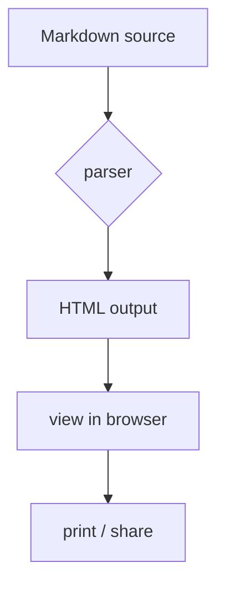
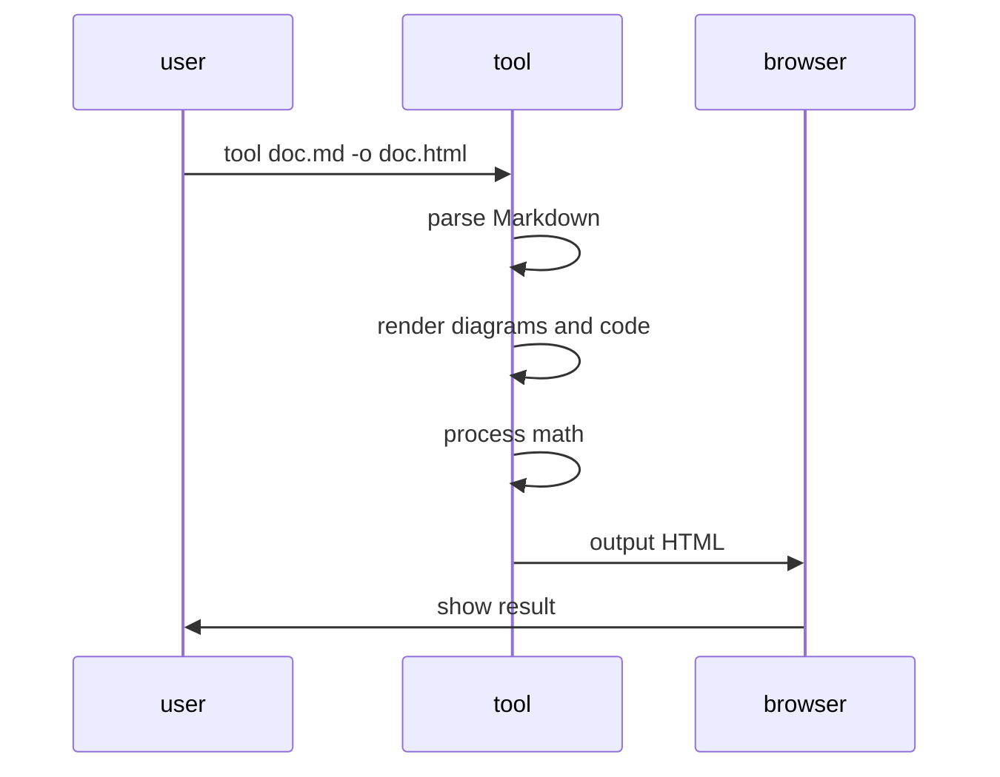
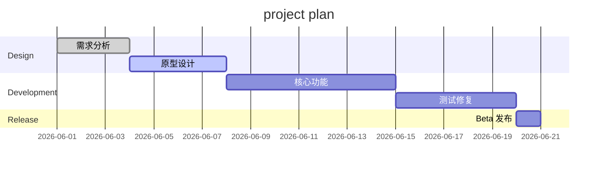
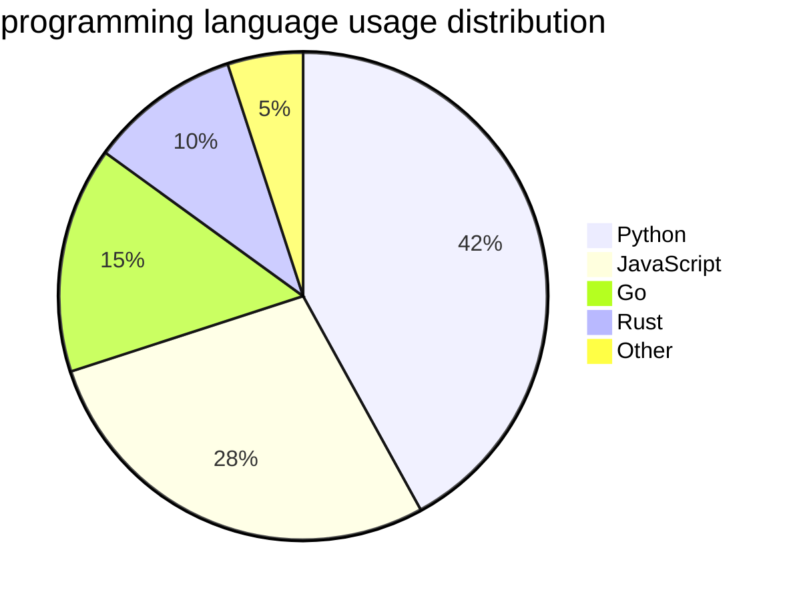

# Markdown Feature Demo

> This is a general-purpose Markdown demo document covering common Markdown syntax, GFM extensions and diagram features. It can be used to verify whether any Markdown renderer produces the expected output.

---

## 📊 Table support

| Feature           | Status | Notes                                                                                                                 |
| ----------------- | ------ | --------------------------------------------------------------------------------------------------------------------- |
| Standard Markdown | ✅     | headings, lists, links, images, etc.                                                                                  |
| GFM tables        | ✅     | header, alignment, cell embedding                                                                                     |
| Mermaid diagrams  | ✅     | flow / sequence / gantt / pie diagrams, etc.                                                                          |
| Code highlight    | ✅     | multiple programming languages                                                                                        |
| Math              | ✅     | inline and block; two delimiter styles, both LaTeX math: dollar `$...$`/`$$...$$` and parentheses `\(...\)`/`\[...\]` |
| Task lists        | ✅     | GFM-style checkboxes                                                                                                  |

## ✅ Task lists

- [x] completed example
- [x] another completed
- [ ] todo example
- [ ] another todo

## 📐 Math

The following covers several common notations; different renderers support different subsets of the syntax.

**Currency / non-formula boundary tests:**

- I bought apples for $5 and oranges for $10.
- I bought apples for $5 and oranges for $10 .

**Inline math (dollar):** $E = mc^2$

**Inline math (LaTeX parens):** \(E = mc^2\)

**Inline math (dollar + inner spaces):** $ E = mc^2 $

**Inline math (dollar + numeric boundary):** $5^2 = 25$

**Block math:**

$$
\int_{0}^{\infty} e^{-x^2} \, dx = \frac{\sqrt{\pi}}{2}
$$

**Matrix:**

$$
\begin{bmatrix}
a & b \\
c & d
\end{bmatrix}
\begin{bmatrix}
x \\
y
\end{bmatrix}
=
\begin{bmatrix}
ax + by \\
cx + dy
\end{bmatrix}
$$

## 🔷 Mermaid flowchart



## 🔷 Mermaid sequence diagram



## 🔷 Mermaid gantt



## 🔷 Mermaid pie



## 💻 Code highlight demo

### Python

```python
import asyncio
from dataclasses import dataclass
from typing import Optional

@dataclass
class Task:
    """a simple task class"""
    name: str
    priority: int = 0
    done: bool = False

    def complete(self) -> None:
        self.done = True

async def process_tasks(tasks: list[Task]) -> list[str]:
    """process a list of tasks asynchronously"""
    results = []
    for task in sorted(tasks, key=lambda t: -t.priority):
        await asyncio.sleep(0.1)
        task.complete()
        results.append(f"✅ {task.name}")
    return results
```

### JavaScript

```javascript
// debounce function
function debounce(fn, delay = 300) {
  let timer = null
  return function (...args) {
    clearTimeout(timer)
    timer = setTimeout(() => fn.apply(this, args), delay)
  }
}

// usage example
const searchInput = document.querySelector('#search')
searchInput.addEventListener(
  'input',
  debounce(async (e) => {
    const results = await fetch(`/api/search?q=${e.target.value}`)
    renderResults(await results.json())
  }, 500),
)
```

### SQL

```sql
-- user activity stats
SELECT
    DATE(created_at) AS date,
    COUNT(DISTINCT user_id) AS active_users,
    COUNT(*) AS total_actions,
    ROUND(COUNT(*) * 1.0 / COUNT(DISTINCT user_id), 2) AS avg_actions_per_user
FROM user_actions
WHERE created_at >= DATE('now', '-30 days')
GROUP BY DATE(created_at)
ORDER BY date DESC;
```

### Shell

```bash
#!/bin/bash
# batch-process Markdown files
TOOL="markdown-tool"

for file in docs/*.md; do
    name=$(basename "$file" .md)
    echo "processing: $file → output/${name}.html"
    $TOOL "$file" -o "output/${name}.html"
done

echo "✅ all done!"
```

## 📝 Blockquotes

> "A good tool makes complex things simple, rather than making simple things complex."
>
> — design philosophy

### Multi-level nested quotes

> first-level quote
>
> > second-level quote
> >
> > > third-level quote — deeper thinking

## 🎯 Admonitions

!!! note "Note"
Some Markdown tools support admonition blocks of the form `!!! type "title"`, with a custom title.

!!! warning "Warning"
Different tools support different subsets of the syntax; consult the docs of the specific tool before use.

!!! tip "Tip"
Many Markdown tools support dark mode and custom themes.

!!! info "Info"
Mermaid diagram syntax is rendered by tools that support the extension; whether it needs network access depends on the implementation.

## 📋 Definition lists

Markdown
: a lightweight markup language created by John Gruber

HTML
: HyperText Markup Language, the standard language for creating web pages

CSS
: Cascading Style Sheets, used to describe the appearance of HTML documents

## 🔗 Abbreviation support

HTML is the foundation of the Web. CSS handles styling, JS handles interaction.

*[HTML]: HyperText Markup Language
*[CSS]: Cascading Style Sheets
*[JS]: JavaScript

## 📸 Images


---

### Happy Coding! 🎉
