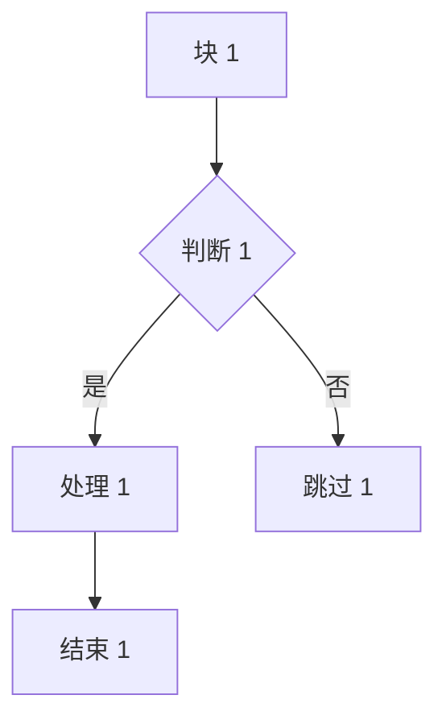
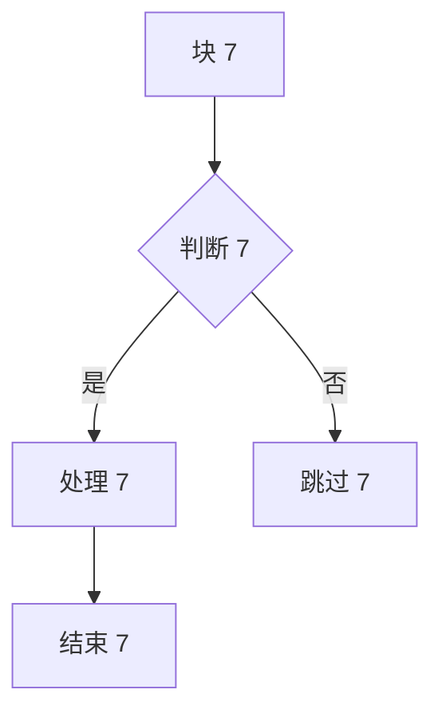
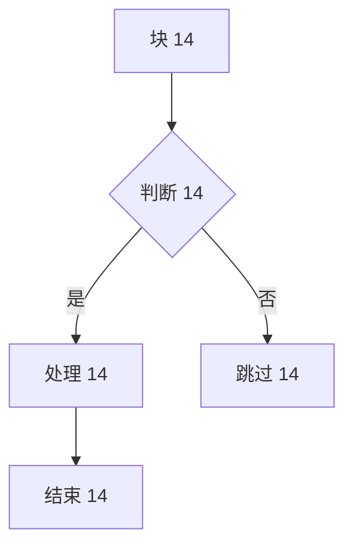
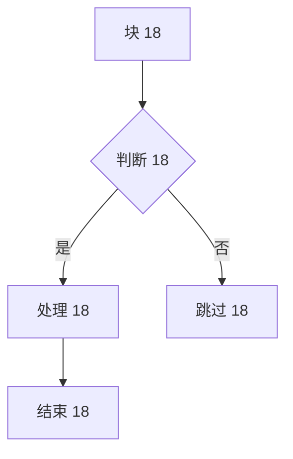

# 大文档性能测试 fixture（demo-large）

> 自动生成，用于 markflow 预览重构的性能基线测试。覆盖三条优化路径：
>
> - **D-E（Mermaid 缓存 + 懒渲染）**：本节含 60 个图表（含重复图以验证 hash 缓存命中）。
> - **R9（本地图片固有尺寸回填）**：含 60 张本地图（`appdoc://`，触发 `documents:image-size` IPC）。
> - **D-D（块级增量渲染）**：含 100 个内容各异的章节，压 parse 与块缓存。
> - **导出 lang（<html lang>）**：frontmatter 设 `lang: zh-CN`，覆盖中文文档导出路径。

---

## 大图抖动演示（R9 验证）

> 下面两张本地图高度 2000px，且当前**未回填固有尺寸**，首屏会产生明显高度跳变；
> 这是 R9 要消除的根因。性能用例据此把 `cls` 作为 R9 的硬指标。


## 功能覆盖速览

| 功能          | 状态 | 说明                          |
| ------------- | ---- | ----------------------------- |
| 标准 Markdown | ✅   | 标题、列表、链接、图片        |
| GFM 表格      | ✅   | 表头、对齐、单元格内嵌        |
| Mermaid       | ✅   | 流程图/时序/甘特/饼/状态/类图 |
| 代码高亮      | ✅   | 多语言                        |
| 数学公式      | ✅   | 行内与块级                    |
| 任务列表      | ✅   | GFM 勾选框                    |

### 任务列表

- [x] 已完成项示例
- [x] 另一项已完成
- [ ] 待办项示例
- [ ] 另一项待办

### 数学公式

行内：$E = mc^2$；块级：

$$
\int_{0}^{\infty} e^{-x^2}\,dx = \frac{\sqrt{\pi}}{2}
$$

### 提示块

!!! note "注意"
本地图片应触发固有尺寸回填，避免首屏高度跳变。

!!! warning "警告"
远程图片不经过 image-size IPC，是已知限制。

### 引用块

> 优秀的工具应该让复杂的事情变简单。
>
> > 这是嵌套引用，用于测试深层结构。

---

## Mermaid 压力测试（60 个）

> 前 20 个为重复图（验证 hash 缓存命中），其余为唯一图。

### Mermaid 1



### Mermaid 2


### Mermaid 3


### Mermaid 4


### Mermaid 5


### Mermaid 6


### Mermaid 7



### Mermaid 8


### Mermaid 9


### Mermaid 10


### Mermaid 11


### Mermaid 12


### Mermaid 13


### Mermaid 14



### Mermaid 15


### Mermaid 16


### Mermaid 17


### Mermaid 18



### Mermaid 19


### Mermaid 20


### Mermaid 21

```mermaid
graph TD
  A[块 21] --> B{判断 21}
  B -->|是| C[处理 21]
  B -->|否| D[跳过 21]
  C --> E[结束 21]
```

### Mermaid 22

```mermaid
sequenceDiagram
  participant U as 用户22
  participant S as 系统22
  U->>S: 请求 22
  S-->>U: 响应 22
  S->>S: 内部处理 22
```

### Mermaid 23

```mermaid
gantt
  title 任务 23
  dateFormat YYYY-MM-DD
  section 阶段23
  设计 :a23, 2026-01-01, 3d
  开发 :b23, after a23, 5d
  测试 :c23, after b23, 2d
```

### Mermaid 24

```mermaid
pie title 分布 24
  "A" : 50
  "B" : 50
  "C" : 20
```

### Mermaid 25

```mermaid
stateDiagram-v2
  [*] --> S1_25
  S1_25 --> S2_25 : 事件25
  S2_25 --> [*]
```

### Mermaid 26

```mermaid
classDiagram
  class C26 {
    +field26: number
    +method26()
  }
  C26 <|-- D26
```

### Mermaid 27

```mermaid
graph TD
  A[块 27] --> B{判断 27}
  B -->|是| C[处理 27]
  B -->|否| D[跳过 27]
  C --> E[结束 27]
```

### Mermaid 28

```mermaid
sequenceDiagram
  participant U as 用户28
  participant S as 系统28
  U->>S: 请求 28
  S-->>U: 响应 28
  S->>S: 内部处理 28
```

### Mermaid 29

```mermaid
gantt
  title 任务 29
  dateFormat YYYY-MM-DD
  section 阶段29
  设计 :a29, 2026-01-01, 3d
  开发 :b29, after a29, 5d
  测试 :c29, after b29, 2d
```

### Mermaid 30

```mermaid
pie title 分布 30
  "A" : 10
  "B" : 90
  "C" : 20
```

### Mermaid 31

```mermaid
stateDiagram-v2
  [*] --> S1_31
  S1_31 --> S2_31 : 事件31
  S2_31 --> [*]
```

### Mermaid 32

```mermaid
classDiagram
  class C32 {
    +field32: number
    +method32()
  }
  C32 <|-- D32
```

### Mermaid 33

```mermaid
graph TD
  A[块 33] --> B{判断 33}
  B -->|是| C[处理 33]
  B -->|否| D[跳过 33]
  C --> E[结束 33]
```

### Mermaid 34

```mermaid
sequenceDiagram
  participant U as 用户34
  participant S as 系统34
  U->>S: 请求 34
  S-->>U: 响应 34
  S->>S: 内部处理 34
```

### Mermaid 35

```mermaid
gantt
  title 任务 35
  dateFormat YYYY-MM-DD
  section 阶段35
  设计 :a35, 2026-01-01, 3d
  开发 :b35, after a35, 5d
  测试 :c35, after b35, 2d
```

### Mermaid 36

```mermaid
pie title 分布 36
  "A" : 20
  "B" : 80
  "C" : 20
```

### Mermaid 37

```mermaid
stateDiagram-v2
  [*] --> S1_37
  S1_37 --> S2_37 : 事件37
  S2_37 --> [*]
```

### Mermaid 38

```mermaid
classDiagram
  class C38 {
    +field38: number
    +method38()
  }
  C38 <|-- D38
```

### Mermaid 39

```mermaid
graph TD
  A[块 39] --> B{判断 39}
  B -->|是| C[处理 39]
  B -->|否| D[跳过 39]
  C --> E[结束 39]
```

### Mermaid 40

```mermaid
sequenceDiagram
  participant U as 用户40
  participant S as 系统40
  U->>S: 请求 40
  S-->>U: 响应 40
  S->>S: 内部处理 40
```

### Mermaid 41

```mermaid
gantt
  title 任务 41
  dateFormat YYYY-MM-DD
  section 阶段41
  设计 :a41, 2026-01-01, 3d
  开发 :b41, after a41, 5d
  测试 :c41, after b41, 2d
```

### Mermaid 42

```mermaid
pie title 分布 42
  "A" : 30
  "B" : 70
  "C" : 20
```

### Mermaid 43

```mermaid
stateDiagram-v2
  [*] --> S1_43
  S1_43 --> S2_43 : 事件43
  S2_43 --> [*]
```

### Mermaid 44

```mermaid
classDiagram
  class C44 {
    +field44: number
    +method44()
  }
  C44 <|-- D44
```

### Mermaid 45

```mermaid
graph TD
  A[块 45] --> B{判断 45}
  B -->|是| C[处理 45]
  B -->|否| D[跳过 45]
  C --> E[结束 45]
```

### Mermaid 46

```mermaid
sequenceDiagram
  participant U as 用户46
  participant S as 系统46
  U->>S: 请求 46
  S-->>U: 响应 46
  S->>S: 内部处理 46
```

### Mermaid 47

```mermaid
gantt
  title 任务 47
  dateFormat YYYY-MM-DD
  section 阶段47
  设计 :a47, 2026-01-01, 3d
  开发 :b47, after a47, 5d
  测试 :c47, after b47, 2d
```

### Mermaid 48

```mermaid
pie title 分布 48
  "A" : 40
  "B" : 60
  "C" : 20
```

### Mermaid 49

```mermaid
stateDiagram-v2
  [*] --> S1_49
  S1_49 --> S2_49 : 事件49
  S2_49 --> [*]
```

### Mermaid 50

```mermaid
classDiagram
  class C50 {
    +field50: number
    +method50()
  }
  C50 <|-- D50
```

### Mermaid 51

```mermaid
graph TD
  A[块 51] --> B{判断 51}
  B -->|是| C[处理 51]
  B -->|否| D[跳过 51]
  C --> E[结束 51]
```

### Mermaid 52

```mermaid
sequenceDiagram
  participant U as 用户52
  participant S as 系统52
  U->>S: 请求 52
  S-->>U: 响应 52
  S->>S: 内部处理 52
```

### Mermaid 53

```mermaid
gantt
  title 任务 53
  dateFormat YYYY-MM-DD
  section 阶段53
  设计 :a53, 2026-01-01, 3d
  开发 :b53, after a53, 5d
  测试 :c53, after b53, 2d
```

### Mermaid 54

```mermaid
pie title 分布 54
  "A" : 50
  "B" : 50
  "C" : 20
```

### Mermaid 55

```mermaid
stateDiagram-v2
  [*] --> S1_55
  S1_55 --> S2_55 : 事件55
  S2_55 --> [*]
```

### Mermaid 56

```mermaid
classDiagram
  class C56 {
    +field56: number
    +method56()
  }
  C56 <|-- D56
```

### Mermaid 57

```mermaid
graph TD
  A[块 57] --> B{判断 57}
  B -->|是| C[处理 57]
  B -->|否| D[跳过 57]
  C --> E[结束 57]
```

### Mermaid 58

```mermaid
sequenceDiagram
  participant U as 用户58
  participant S as 系统58
  U->>S: 请求 58
  S-->>U: 响应 58
  S->>S: 内部处理 58
```

### Mermaid 59

```mermaid
gantt
  title 任务 59
  dateFormat YYYY-MM-DD
  section 阶段59
  设计 :a59, 2026-01-01, 3d
  开发 :b59, after a59, 5d
  测试 :c59, after b59, 2d
```

### Mermaid 60

```mermaid
pie title 分布 60
  "A" : 10
  "B" : 90
  "C" : 20
```

## 图片压力测试（60 张本地图 + 1 张远程图）

> 本地图经 `appdoc://` 解析，触发 `documents:image-size` IPC；远程图仅作对照。


---

## 章节压力测试（100 章）

### 第 1 章 · python 示例

这是第 1 章的示例段落，用于压测块级解析与增量渲染。每个章节包含代码、表格、列表、引用与提示块，模拟真实长文档的结构多样性。

```python
def fn_1(n):
    """示例 1"""
    return [x * 1 for x in range(n)]
```

| 指标 | 值     |
| ---- | ------ |
| 章节 | 1      |
| 语言 | python |

- 列表项一（1）
- 列表项二
- 列表项三

> 第 1 章的引用。

!!! tip "章节提示 1"
本章使用 python 演示块级增量渲染的缓存命中行为。

---

### 第 2 章 · javascript 示例

这是第 2 章的示例段落，用于压测块级解析与增量渲染。每个章节包含代码、表格、列表、引用与提示块，模拟真实长文档的结构多样性。

```javascript
function fn2(n) {
  // 示例 2
  return Array.from({ length: n }, (_, x) => x * 2)
}
```

| 指标 | 值         |
| ---- | ---------- |
| 章节 | 2          |
| 语言 | javascript |

- 列表项一（2）
- 列表项二
- 列表项三

> 第 2 章的引用。

!!! tip "章节提示 2"
本章使用 javascript 演示块级增量渲染的缓存命中行为。

---

### 第 3 章 · typescript 示例

这是第 3 章的示例段落，用于压测块级解析与增量渲染。每个章节包含代码、表格、列表、引用与提示块，模拟真实长文档的结构多样性。

```typescript
function fn3(n: number): number[] {
  // 示例 3
  return Array.from({ length: n }, (_, x) => x * 3)
}
```

| 指标 | 值         |
| ---- | ---------- |
| 章节 | 3          |
| 语言 | typescript |

- 列表项一（3）
- 列表项二
- 列表项三

> 第 3 章的引用。

!!! tip "章节提示 3"
本章使用 typescript 演示块级增量渲染的缓存命中行为。

---

### 第 4 章 · sql 示例

这是第 4 章的示例段落，用于压测块级解析与增量渲染。每个章节包含代码、表格、列表、引用与提示块，模拟真实长文档的结构多样性。

```sql
SELECT id, name
FROM t_4
WHERE active = 1
ORDER BY id DESC
LIMIT 10;
```

| 指标 | 值  |
| ---- | --- |
| 章节 | 4   |
| 语言 | sql |

- 列表项一（4）
- 列表项二
- 列表项三

> 第 4 章的引用。

!!! tip "章节提示 4"
本章使用 sql 演示块级增量渲染的缓存命中行为。

---

### 第 5 章 · bash 示例

这是第 5 章的示例段落，用于压测块级解析与增量渲染。每个章节包含代码、表格、列表、引用与提示块，模拟真实长文档的结构多样性。

```bash
#!/bin/bash
# 示例 5
for f in docs/*.md; do
  echo "处理 $f (5)"
done
```

| 指标 | 值   |
| ---- | ---- |
| 章节 | 5    |
| 语言 | bash |

- 列表项一（5）
- 列表项二
- 列表项三

> 第 5 章的引用。

!!! tip "章节提示 5"
本章使用 bash 演示块级增量渲染的缓存命中行为。

---

### 第 6 章 · go 示例

这是第 6 章的示例段落，用于压测块级解析与增量渲染。每个章节包含代码、表格、列表、引用与提示块，模拟真实长文档的结构多样性。

```go
package main

import "fmt"

func fn6(n int) []int {
 out := make([]int, n)
 for x := 0; x < n; x++ {
  out[x] = x * 6
 }
 return out
}
```

| 指标 | 值  |
| ---- | --- |
| 章节 | 6   |
| 语言 | go  |

- 列表项一（6）
- 列表项二
- 列表项三

> 第 6 章的引用。

!!! tip "章节提示 6"
本章使用 go 演示块级增量渲染的缓存命中行为。

---

### 第 7 章 · rust 示例

这是第 7 章的示例段落，用于压测块级解析与增量渲染。每个章节包含代码、表格、列表、引用与提示块，模拟真实长文档的结构多样性。

```rust
fn fn_7(n: usize) -> Vec<usize> {
    // 示例 7
    (0..n).map(|x| x * 7).collect()
}
```

| 指标 | 值   |
| ---- | ---- |
| 章节 | 7    |
| 语言 | rust |

- 列表项一（7）
- 列表项二
- 列表项三

> 第 7 章的引用。

!!! tip "章节提示 7"
本章使用 rust 演示块级增量渲染的缓存命中行为。

---

### 第 8 章 · json 示例

这是第 8 章的示例段落，用于压测块级解析与增量渲染。每个章节包含代码、表格、列表、引用与提示块，模拟真实长文档的结构多样性。

```json
{
  "id": 8,
  "name": "item-8",
  "active": true
}
```

| 指标 | 值   |
| ---- | ---- |
| 章节 | 8    |
| 语言 | json |

- 列表项一（8）
- 列表项二
- 列表项三

> 第 8 章的引用。

!!! tip "章节提示 8"
本章使用 json 演示块级增量渲染的缓存命中行为。

---

### 第 9 章 · yaml 示例

这是第 9 章的示例段落，用于压测块级解析与增量渲染。每个章节包含代码、表格、列表、引用与提示块，模拟真实长文档的结构多样性。

```yaml
task_9:
  name: 示例 9
  active: true
  retries: 3
```

| 指标 | 值   |
| ---- | ---- |
| 章节 | 9    |
| 语言 | yaml |

- 列表项一（9）
- 列表项二
- 列表项三

> 第 9 章的引用。

!!! tip "章节提示 9"
本章使用 yaml 演示块级增量渲染的缓存命中行为。

---

### 第 10 章 · java 示例

这是第 10 章的示例段落，用于压测块级解析与增量渲染。每个章节包含代码、表格、列表、引用与提示块，模拟真实长文档的结构多样性。

```java
public List<Integer> fn10(int n) {
  // 示例 10
  List<Integer> out = new ArrayList<>();
  for (int x = 0; x < n; x++) out.add(x * 10);
  return out;
}
```

| 指标 | 值   |
| ---- | ---- |
| 章节 | 10   |
| 语言 | java |

- 列表项一（10）
- 列表项二
- 列表项三

> 第 10 章的引用。

!!! tip "章节提示 10"
本章使用 java 演示块级增量渲染的缓存命中行为。

---

### 第 11 章 · python 示例

这是第 11 章的示例段落，用于压测块级解析与增量渲染。每个章节包含代码、表格、列表、引用与提示块，模拟真实长文档的结构多样性。

```python
def fn_11(n):
    """示例 11"""
    return [x * 11 for x in range(n)]
```

| 指标 | 值     |
| ---- | ------ |
| 章节 | 11     |
| 语言 | python |

- 列表项一（11）
- 列表项二
- 列表项三

> 第 11 章的引用。

!!! tip "章节提示 11"
本章使用 python 演示块级增量渲染的缓存命中行为。

---

### 第 12 章 · javascript 示例

这是第 12 章的示例段落，用于压测块级解析与增量渲染。每个章节包含代码、表格、列表、引用与提示块，模拟真实长文档的结构多样性。

```javascript
function fn12(n) {
  // 示例 12
  return Array.from({ length: n }, (_, x) => x * 12)
}
```

| 指标 | 值         |
| ---- | ---------- |
| 章节 | 12         |
| 语言 | javascript |

- 列表项一（12）
- 列表项二
- 列表项三

> 第 12 章的引用。

!!! tip "章节提示 12"
本章使用 javascript 演示块级增量渲染的缓存命中行为。

---

### 第 13 章 · typescript 示例

这是第 13 章的示例段落，用于压测块级解析与增量渲染。每个章节包含代码、表格、列表、引用与提示块，模拟真实长文档的结构多样性。

```typescript
function fn13(n: number): number[] {
  // 示例 13
  return Array.from({ length: n }, (_, x) => x * 13)
}
```

| 指标 | 值         |
| ---- | ---------- |
| 章节 | 13         |
| 语言 | typescript |

- 列表项一（13）
- 列表项二
- 列表项三

> 第 13 章的引用。

!!! tip "章节提示 13"
本章使用 typescript 演示块级增量渲染的缓存命中行为。

---

### 第 14 章 · sql 示例

这是第 14 章的示例段落，用于压测块级解析与增量渲染。每个章节包含代码、表格、列表、引用与提示块，模拟真实长文档的结构多样性。

```sql
SELECT id, name
FROM t_14
WHERE active = 1
ORDER BY id DESC
LIMIT 10;
```

| 指标 | 值  |
| ---- | --- |
| 章节 | 14  |
| 语言 | sql |

- 列表项一（14）
- 列表项二
- 列表项三

> 第 14 章的引用。

!!! tip "章节提示 14"
本章使用 sql 演示块级增量渲染的缓存命中行为。

---

### 第 15 章 · bash 示例

这是第 15 章的示例段落，用于压测块级解析与增量渲染。每个章节包含代码、表格、列表、引用与提示块，模拟真实长文档的结构多样性。

```bash
#!/bin/bash
# 示例 15
for f in docs/*.md; do
  echo "处理 $f (15)"
done
```

| 指标 | 值   |
| ---- | ---- |
| 章节 | 15   |
| 语言 | bash |

- 列表项一（15）
- 列表项二
- 列表项三

> 第 15 章的引用。

!!! tip "章节提示 15"
本章使用 bash 演示块级增量渲染的缓存命中行为。

---

### 第 16 章 · go 示例

这是第 16 章的示例段落，用于压测块级解析与增量渲染。每个章节包含代码、表格、列表、引用与提示块，模拟真实长文档的结构多样性。

```go
package main

import "fmt"

func fn16(n int) []int {
 out := make([]int, n)
 for x := 0; x < n; x++ {
  out[x] = x * 16
 }
 return out
}
```

| 指标 | 值  |
| ---- | --- |
| 章节 | 16  |
| 语言 | go  |

- 列表项一（16）
- 列表项二
- 列表项三

> 第 16 章的引用。

!!! tip "章节提示 16"
本章使用 go 演示块级增量渲染的缓存命中行为。

---

### 第 17 章 · rust 示例

这是第 17 章的示例段落，用于压测块级解析与增量渲染。每个章节包含代码、表格、列表、引用与提示块，模拟真实长文档的结构多样性。

```rust
fn fn_17(n: usize) -> Vec<usize> {
    // 示例 17
    (0..n).map(|x| x * 17).collect()
}
```

| 指标 | 值   |
| ---- | ---- |
| 章节 | 17   |
| 语言 | rust |

- 列表项一（17）
- 列表项二
- 列表项三

> 第 17 章的引用。

!!! tip "章节提示 17"
本章使用 rust 演示块级增量渲染的缓存命中行为。

---

### 第 18 章 · json 示例

这是第 18 章的示例段落，用于压测块级解析与增量渲染。每个章节包含代码、表格、列表、引用与提示块，模拟真实长文档的结构多样性。

```json
{
  "id": 18,
  "name": "item-18",
  "active": true
}
```

| 指标 | 值   |
| ---- | ---- |
| 章节 | 18   |
| 语言 | json |

- 列表项一（18）
- 列表项二
- 列表项三

> 第 18 章的引用。

!!! tip "章节提示 18"
本章使用 json 演示块级增量渲染的缓存命中行为。

---

### 第 19 章 · yaml 示例

这是第 19 章的示例段落，用于压测块级解析与增量渲染。每个章节包含代码、表格、列表、引用与提示块，模拟真实长文档的结构多样性。

```yaml
task_19:
  name: 示例 19
  active: true
  retries: 3
```

| 指标 | 值   |
| ---- | ---- |
| 章节 | 19   |
| 语言 | yaml |

- 列表项一（19）
- 列表项二
- 列表项三

> 第 19 章的引用。

!!! tip "章节提示 19"
本章使用 yaml 演示块级增量渲染的缓存命中行为。

---

### 第 20 章 · java 示例

这是第 20 章的示例段落，用于压测块级解析与增量渲染。每个章节包含代码、表格、列表、引用与提示块，模拟真实长文档的结构多样性。

```java
public List<Integer> fn20(int n) {
  // 示例 20
  List<Integer> out = new ArrayList<>();
  for (int x = 0; x < n; x++) out.add(x * 20);
  return out;
}
```

| 指标 | 值   |
| ---- | ---- |
| 章节 | 20   |
| 语言 | java |

- 列表项一（20）
- 列表项二
- 列表项三

> 第 20 章的引用。

!!! tip "章节提示 20"
本章使用 java 演示块级增量渲染的缓存命中行为。

---

### 第 21 章 · python 示例

这是第 21 章的示例段落，用于压测块级解析与增量渲染。每个章节包含代码、表格、列表、引用与提示块，模拟真实长文档的结构多样性。

```python
def fn_21(n):
    """示例 21"""
    return [x * 21 for x in range(n)]
```

| 指标 | 值     |
| ---- | ------ |
| 章节 | 21     |
| 语言 | python |

- 列表项一（21）
- 列表项二
- 列表项三

> 第 21 章的引用。

!!! tip "章节提示 21"
本章使用 python 演示块级增量渲染的缓存命中行为。

---

### 第 22 章 · javascript 示例

这是第 22 章的示例段落，用于压测块级解析与增量渲染。每个章节包含代码、表格、列表、引用与提示块，模拟真实长文档的结构多样性。

```javascript
function fn22(n) {
  // 示例 22
  return Array.from({ length: n }, (_, x) => x * 22)
}
```

| 指标 | 值         |
| ---- | ---------- |
| 章节 | 22         |
| 语言 | javascript |

- 列表项一（22）
- 列表项二
- 列表项三

> 第 22 章的引用。

!!! tip "章节提示 22"
本章使用 javascript 演示块级增量渲染的缓存命中行为。

---

### 第 23 章 · typescript 示例

这是第 23 章的示例段落，用于压测块级解析与增量渲染。每个章节包含代码、表格、列表、引用与提示块，模拟真实长文档的结构多样性。

```typescript
function fn23(n: number): number[] {
  // 示例 23
  return Array.from({ length: n }, (_, x) => x * 23)
}
```

| 指标 | 值         |
| ---- | ---------- |
| 章节 | 23         |
| 语言 | typescript |

- 列表项一（23）
- 列表项二
- 列表项三

> 第 23 章的引用。

!!! tip "章节提示 23"
本章使用 typescript 演示块级增量渲染的缓存命中行为。

---

### 第 24 章 · sql 示例

这是第 24 章的示例段落，用于压测块级解析与增量渲染。每个章节包含代码、表格、列表、引用与提示块，模拟真实长文档的结构多样性。

```sql
SELECT id, name
FROM t_24
WHERE active = 1
ORDER BY id DESC
LIMIT 10;
```

| 指标 | 值  |
| ---- | --- |
| 章节 | 24  |
| 语言 | sql |

- 列表项一（24）
- 列表项二
- 列表项三

> 第 24 章的引用。

!!! tip "章节提示 24"
本章使用 sql 演示块级增量渲染的缓存命中行为。

---

### 第 25 章 · bash 示例

这是第 25 章的示例段落，用于压测块级解析与增量渲染。每个章节包含代码、表格、列表、引用与提示块，模拟真实长文档的结构多样性。

```bash
#!/bin/bash
# 示例 25
for f in docs/*.md; do
  echo "处理 $f (25)"
done
```

| 指标 | 值   |
| ---- | ---- |
| 章节 | 25   |
| 语言 | bash |

- 列表项一（25）
- 列表项二
- 列表项三

> 第 25 章的引用。

!!! tip "章节提示 25"
本章使用 bash 演示块级增量渲染的缓存命中行为。

---

### 第 26 章 · go 示例

这是第 26 章的示例段落，用于压测块级解析与增量渲染。每个章节包含代码、表格、列表、引用与提示块，模拟真实长文档的结构多样性。

```go
package main

import "fmt"

func fn26(n int) []int {
 out := make([]int, n)
 for x := 0; x < n; x++ {
  out[x] = x * 26
 }
 return out
}
```

| 指标 | 值  |
| ---- | --- |
| 章节 | 26  |
| 语言 | go  |

- 列表项一（26）
- 列表项二
- 列表项三

> 第 26 章的引用。

!!! tip "章节提示 26"
本章使用 go 演示块级增量渲染的缓存命中行为。

---

### 第 27 章 · rust 示例

这是第 27 章的示例段落，用于压测块级解析与增量渲染。每个章节包含代码、表格、列表、引用与提示块，模拟真实长文档的结构多样性。

```rust
fn fn_27(n: usize) -> Vec<usize> {
    // 示例 27
    (0..n).map(|x| x * 27).collect()
}
```

| 指标 | 值   |
| ---- | ---- |
| 章节 | 27   |
| 语言 | rust |

- 列表项一（27）
- 列表项二
- 列表项三

> 第 27 章的引用。

!!! tip "章节提示 27"
本章使用 rust 演示块级增量渲染的缓存命中行为。

---

### 第 28 章 · json 示例

这是第 28 章的示例段落，用于压测块级解析与增量渲染。每个章节包含代码、表格、列表、引用与提示块，模拟真实长文档的结构多样性。

```json
{
  "id": 28,
  "name": "item-28",
  "active": true
}
```

| 指标 | 值   |
| ---- | ---- |
| 章节 | 28   |
| 语言 | json |

- 列表项一（28）
- 列表项二
- 列表项三

> 第 28 章的引用。

!!! tip "章节提示 28"
本章使用 json 演示块级增量渲染的缓存命中行为。

---

### 第 29 章 · yaml 示例

这是第 29 章的示例段落，用于压测块级解析与增量渲染。每个章节包含代码、表格、列表、引用与提示块，模拟真实长文档的结构多样性。

```yaml
task_29:
  name: 示例 29
  active: true
  retries: 3
```

| 指标 | 值   |
| ---- | ---- |
| 章节 | 29   |
| 语言 | yaml |

- 列表项一（29）
- 列表项二
- 列表项三

> 第 29 章的引用。

!!! tip "章节提示 29"
本章使用 yaml 演示块级增量渲染的缓存命中行为。

---

### 第 30 章 · java 示例

这是第 30 章的示例段落，用于压测块级解析与增量渲染。每个章节包含代码、表格、列表、引用与提示块，模拟真实长文档的结构多样性。

```java
public List<Integer> fn30(int n) {
  // 示例 30
  List<Integer> out = new ArrayList<>();
  for (int x = 0; x < n; x++) out.add(x * 30);
  return out;
}
```

| 指标 | 值   |
| ---- | ---- |
| 章节 | 30   |
| 语言 | java |

- 列表项一（30）
- 列表项二
- 列表项三

> 第 30 章的引用。

!!! tip "章节提示 30"
本章使用 java 演示块级增量渲染的缓存命中行为。

---

### 第 31 章 · python 示例

这是第 31 章的示例段落，用于压测块级解析与增量渲染。每个章节包含代码、表格、列表、引用与提示块，模拟真实长文档的结构多样性。

```python
def fn_31(n):
    """示例 31"""
    return [x * 31 for x in range(n)]
```

| 指标 | 值     |
| ---- | ------ |
| 章节 | 31     |
| 语言 | python |

- 列表项一（31）
- 列表项二
- 列表项三

> 第 31 章的引用。

!!! tip "章节提示 31"
本章使用 python 演示块级增量渲染的缓存命中行为。

---

### 第 32 章 · javascript 示例

这是第 32 章的示例段落，用于压测块级解析与增量渲染。每个章节包含代码、表格、列表、引用与提示块，模拟真实长文档的结构多样性。

```javascript
function fn32(n) {
  // 示例 32
  return Array.from({ length: n }, (_, x) => x * 32)
}
```

| 指标 | 值         |
| ---- | ---------- |
| 章节 | 32         |
| 语言 | javascript |

- 列表项一（32）
- 列表项二
- 列表项三

> 第 32 章的引用。

!!! tip "章节提示 32"
本章使用 javascript 演示块级增量渲染的缓存命中行为。

---

### 第 33 章 · typescript 示例

这是第 33 章的示例段落，用于压测块级解析与增量渲染。每个章节包含代码、表格、列表、引用与提示块，模拟真实长文档的结构多样性。

```typescript
function fn33(n: number): number[] {
  // 示例 33
  return Array.from({ length: n }, (_, x) => x * 33)
}
```

| 指标 | 值         |
| ---- | ---------- |
| 章节 | 33         |
| 语言 | typescript |

- 列表项一（33）
- 列表项二
- 列表项三

> 第 33 章的引用。

!!! tip "章节提示 33"
本章使用 typescript 演示块级增量渲染的缓存命中行为。

---

### 第 34 章 · sql 示例

这是第 34 章的示例段落，用于压测块级解析与增量渲染。每个章节包含代码、表格、列表、引用与提示块，模拟真实长文档的结构多样性。

```sql
SELECT id, name
FROM t_34
WHERE active = 1
ORDER BY id DESC
LIMIT 10;
```

| 指标 | 值  |
| ---- | --- |
| 章节 | 34  |
| 语言 | sql |

- 列表项一（34）
- 列表项二
- 列表项三

> 第 34 章的引用。

!!! tip "章节提示 34"
本章使用 sql 演示块级增量渲染的缓存命中行为。

---

### 第 35 章 · bash 示例

这是第 35 章的示例段落，用于压测块级解析与增量渲染。每个章节包含代码、表格、列表、引用与提示块，模拟真实长文档的结构多样性。

```bash
#!/bin/bash
# 示例 35
for f in docs/*.md; do
  echo "处理 $f (35)"
done
```

| 指标 | 值   |
| ---- | ---- |
| 章节 | 35   |
| 语言 | bash |

- 列表项一（35）
- 列表项二
- 列表项三

> 第 35 章的引用。

!!! tip "章节提示 35"
本章使用 bash 演示块级增量渲染的缓存命中行为。

---

### 第 36 章 · go 示例

这是第 36 章的示例段落，用于压测块级解析与增量渲染。每个章节包含代码、表格、列表、引用与提示块，模拟真实长文档的结构多样性。

```go
package main

import "fmt"

func fn36(n int) []int {
 out := make([]int, n)
 for x := 0; x < n; x++ {
  out[x] = x * 36
 }
 return out
}
```

| 指标 | 值  |
| ---- | --- |
| 章节 | 36  |
| 语言 | go  |

- 列表项一（36）
- 列表项二
- 列表项三

> 第 36 章的引用。

!!! tip "章节提示 36"
本章使用 go 演示块级增量渲染的缓存命中行为。

---

### 第 37 章 · rust 示例

这是第 37 章的示例段落，用于压测块级解析与增量渲染。每个章节包含代码、表格、列表、引用与提示块，模拟真实长文档的结构多样性。

```rust
fn fn_37(n: usize) -> Vec<usize> {
    // 示例 37
    (0..n).map(|x| x * 37).collect()
}
```

| 指标 | 值   |
| ---- | ---- |
| 章节 | 37   |
| 语言 | rust |

- 列表项一（37）
- 列表项二
- 列表项三

> 第 37 章的引用。

!!! tip "章节提示 37"
本章使用 rust 演示块级增量渲染的缓存命中行为。

---

### 第 38 章 · json 示例

这是第 38 章的示例段落，用于压测块级解析与增量渲染。每个章节包含代码、表格、列表、引用与提示块，模拟真实长文档的结构多样性。

```json
{
  "id": 38,
  "name": "item-38",
  "active": true
}
```

| 指标 | 值   |
| ---- | ---- |
| 章节 | 38   |
| 语言 | json |

- 列表项一（38）
- 列表项二
- 列表项三

> 第 38 章的引用。

!!! tip "章节提示 38"
本章使用 json 演示块级增量渲染的缓存命中行为。

---

### 第 39 章 · yaml 示例

这是第 39 章的示例段落，用于压测块级解析与增量渲染。每个章节包含代码、表格、列表、引用与提示块，模拟真实长文档的结构多样性。

```yaml
task_39:
  name: 示例 39
  active: true
  retries: 3
```

| 指标 | 值   |
| ---- | ---- |
| 章节 | 39   |
| 语言 | yaml |

- 列表项一（39）
- 列表项二
- 列表项三

> 第 39 章的引用。

!!! tip "章节提示 39"
本章使用 yaml 演示块级增量渲染的缓存命中行为。

---

### 第 40 章 · java 示例

这是第 40 章的示例段落，用于压测块级解析与增量渲染。每个章节包含代码、表格、列表、引用与提示块，模拟真实长文档的结构多样性。

```java
public List<Integer> fn40(int n) {
  // 示例 40
  List<Integer> out = new ArrayList<>();
  for (int x = 0; x < n; x++) out.add(x * 40);
  return out;
}
```

| 指标 | 值   |
| ---- | ---- |
| 章节 | 40   |
| 语言 | java |

- 列表项一（40）
- 列表项二
- 列表项三

> 第 40 章的引用。

!!! tip "章节提示 40"
本章使用 java 演示块级增量渲染的缓存命中行为。

---

### 第 41 章 · python 示例

这是第 41 章的示例段落，用于压测块级解析与增量渲染。每个章节包含代码、表格、列表、引用与提示块，模拟真实长文档的结构多样性。

```python
def fn_41(n):
    """示例 41"""
    return [x * 41 for x in range(n)]
```

| 指标 | 值     |
| ---- | ------ |
| 章节 | 41     |
| 语言 | python |

- 列表项一（41）
- 列表项二
- 列表项三

> 第 41 章的引用。

!!! tip "章节提示 41"
本章使用 python 演示块级增量渲染的缓存命中行为。

---

### 第 42 章 · javascript 示例

这是第 42 章的示例段落，用于压测块级解析与增量渲染。每个章节包含代码、表格、列表、引用与提示块，模拟真实长文档的结构多样性。

```javascript
function fn42(n) {
  // 示例 42
  return Array.from({ length: n }, (_, x) => x * 42)
}
```

| 指标 | 值         |
| ---- | ---------- |
| 章节 | 42         |
| 语言 | javascript |

- 列表项一（42）
- 列表项二
- 列表项三

> 第 42 章的引用。

!!! tip "章节提示 42"
本章使用 javascript 演示块级增量渲染的缓存命中行为。

---

### 第 43 章 · typescript 示例

这是第 43 章的示例段落，用于压测块级解析与增量渲染。每个章节包含代码、表格、列表、引用与提示块，模拟真实长文档的结构多样性。

```typescript
function fn43(n: number): number[] {
  // 示例 43
  return Array.from({ length: n }, (_, x) => x * 43)
}
```

| 指标 | 值         |
| ---- | ---------- |
| 章节 | 43         |
| 语言 | typescript |

- 列表项一（43）
- 列表项二
- 列表项三

> 第 43 章的引用。

!!! tip "章节提示 43"
本章使用 typescript 演示块级增量渲染的缓存命中行为。

---

### 第 44 章 · sql 示例

这是第 44 章的示例段落，用于压测块级解析与增量渲染。每个章节包含代码、表格、列表、引用与提示块，模拟真实长文档的结构多样性。

```sql
SELECT id, name
FROM t_44
WHERE active = 1
ORDER BY id DESC
LIMIT 10;
```

| 指标 | 值  |
| ---- | --- |
| 章节 | 44  |
| 语言 | sql |

- 列表项一（44）
- 列表项二
- 列表项三

> 第 44 章的引用。

!!! tip "章节提示 44"
本章使用 sql 演示块级增量渲染的缓存命中行为。

---

### 第 45 章 · bash 示例

这是第 45 章的示例段落，用于压测块级解析与增量渲染。每个章节包含代码、表格、列表、引用与提示块，模拟真实长文档的结构多样性。

```bash
#!/bin/bash
# 示例 45
for f in docs/*.md; do
  echo "处理 $f (45)"
done
```

| 指标 | 值   |
| ---- | ---- |
| 章节 | 45   |
| 语言 | bash |

- 列表项一（45）
- 列表项二
- 列表项三

> 第 45 章的引用。

!!! tip "章节提示 45"
本章使用 bash 演示块级增量渲染的缓存命中行为。

---

### 第 46 章 · go 示例

这是第 46 章的示例段落，用于压测块级解析与增量渲染。每个章节包含代码、表格、列表、引用与提示块，模拟真实长文档的结构多样性。

```go
package main

import "fmt"

func fn46(n int) []int {
 out := make([]int, n)
 for x := 0; x < n; x++ {
  out[x] = x * 46
 }
 return out
}
```

| 指标 | 值  |
| ---- | --- |
| 章节 | 46  |
| 语言 | go  |

- 列表项一（46）
- 列表项二
- 列表项三

> 第 46 章的引用。

!!! tip "章节提示 46"
本章使用 go 演示块级增量渲染的缓存命中行为。

---

### 第 47 章 · rust 示例

这是第 47 章的示例段落，用于压测块级解析与增量渲染。每个章节包含代码、表格、列表、引用与提示块，模拟真实长文档的结构多样性。

```rust
fn fn_47(n: usize) -> Vec<usize> {
    // 示例 47
    (0..n).map(|x| x * 47).collect()
}
```

| 指标 | 值   |
| ---- | ---- |
| 章节 | 47   |
| 语言 | rust |

- 列表项一（47）
- 列表项二
- 列表项三

> 第 47 章的引用。

!!! tip "章节提示 47"
本章使用 rust 演示块级增量渲染的缓存命中行为。

---

### 第 48 章 · json 示例

这是第 48 章的示例段落，用于压测块级解析与增量渲染。每个章节包含代码、表格、列表、引用与提示块，模拟真实长文档的结构多样性。

```json
{
  "id": 48,
  "name": "item-48",
  "active": true
}
```

| 指标 | 值   |
| ---- | ---- |
| 章节 | 48   |
| 语言 | json |

- 列表项一（48）
- 列表项二
- 列表项三

> 第 48 章的引用。

!!! tip "章节提示 48"
本章使用 json 演示块级增量渲染的缓存命中行为。

---

### 第 49 章 · yaml 示例

这是第 49 章的示例段落，用于压测块级解析与增量渲染。每个章节包含代码、表格、列表、引用与提示块，模拟真实长文档的结构多样性。

```yaml
task_49:
  name: 示例 49
  active: true
  retries: 3
```

| 指标 | 值   |
| ---- | ---- |
| 章节 | 49   |
| 语言 | yaml |

- 列表项一（49）
- 列表项二
- 列表项三

> 第 49 章的引用。

!!! tip "章节提示 49"
本章使用 yaml 演示块级增量渲染的缓存命中行为。

---

### 第 50 章 · java 示例

这是第 50 章的示例段落，用于压测块级解析与增量渲染。每个章节包含代码、表格、列表、引用与提示块，模拟真实长文档的结构多样性。

```java
public List<Integer> fn50(int n) {
  // 示例 50
  List<Integer> out = new ArrayList<>();
  for (int x = 0; x < n; x++) out.add(x * 50);
  return out;
}
```

| 指标 | 值   |
| ---- | ---- |
| 章节 | 50   |
| 语言 | java |

- 列表项一（50）
- 列表项二
- 列表项三

> 第 50 章的引用。

!!! tip "章节提示 50"
本章使用 java 演示块级增量渲染的缓存命中行为。

---

### 第 51 章 · python 示例

这是第 51 章的示例段落，用于压测块级解析与增量渲染。每个章节包含代码、表格、列表、引用与提示块，模拟真实长文档的结构多样性。

```python
def fn_51(n):
    """示例 51"""
    return [x * 51 for x in range(n)]
```

| 指标 | 值     |
| ---- | ------ |
| 章节 | 51     |
| 语言 | python |

- 列表项一（51）
- 列表项二
- 列表项三

> 第 51 章的引用。

!!! tip "章节提示 51"
本章使用 python 演示块级增量渲染的缓存命中行为。

---

### 第 52 章 · javascript 示例

这是第 52 章的示例段落，用于压测块级解析与增量渲染。每个章节包含代码、表格、列表、引用与提示块，模拟真实长文档的结构多样性。

```javascript
function fn52(n) {
  // 示例 52
  return Array.from({ length: n }, (_, x) => x * 52)
}
```

| 指标 | 值         |
| ---- | ---------- |
| 章节 | 52         |
| 语言 | javascript |

- 列表项一（52）
- 列表项二
- 列表项三

> 第 52 章的引用。

!!! tip "章节提示 52"
本章使用 javascript 演示块级增量渲染的缓存命中行为。

---

### 第 53 章 · typescript 示例

这是第 53 章的示例段落，用于压测块级解析与增量渲染。每个章节包含代码、表格、列表、引用与提示块，模拟真实长文档的结构多样性。

```typescript
function fn53(n: number): number[] {
  // 示例 53
  return Array.from({ length: n }, (_, x) => x * 53)
}
```

| 指标 | 值         |
| ---- | ---------- |
| 章节 | 53         |
| 语言 | typescript |

- 列表项一（53）
- 列表项二
- 列表项三

> 第 53 章的引用。

!!! tip "章节提示 53"
本章使用 typescript 演示块级增量渲染的缓存命中行为。

---

### 第 54 章 · sql 示例

这是第 54 章的示例段落，用于压测块级解析与增量渲染。每个章节包含代码、表格、列表、引用与提示块，模拟真实长文档的结构多样性。

```sql
SELECT id, name
FROM t_54
WHERE active = 1
ORDER BY id DESC
LIMIT 10;
```

| 指标 | 值  |
| ---- | --- |
| 章节 | 54  |
| 语言 | sql |

- 列表项一（54）
- 列表项二
- 列表项三

> 第 54 章的引用。

!!! tip "章节提示 54"
本章使用 sql 演示块级增量渲染的缓存命中行为。

---

### 第 55 章 · bash 示例

这是第 55 章的示例段落，用于压测块级解析与增量渲染。每个章节包含代码、表格、列表、引用与提示块，模拟真实长文档的结构多样性。

```bash
#!/bin/bash
# 示例 55
for f in docs/*.md; do
  echo "处理 $f (55)"
done
```

| 指标 | 值   |
| ---- | ---- |
| 章节 | 55   |
| 语言 | bash |

- 列表项一（55）
- 列表项二
- 列表项三

> 第 55 章的引用。

!!! tip "章节提示 55"
本章使用 bash 演示块级增量渲染的缓存命中行为。

---

### 第 56 章 · go 示例

这是第 56 章的示例段落，用于压测块级解析与增量渲染。每个章节包含代码、表格、列表、引用与提示块，模拟真实长文档的结构多样性。

```go
package main

import "fmt"

func fn56(n int) []int {
 out := make([]int, n)
 for x := 0; x < n; x++ {
  out[x] = x * 56
 }
 return out
}
```

| 指标 | 值  |
| ---- | --- |
| 章节 | 56  |
| 语言 | go  |

- 列表项一（56）
- 列表项二
- 列表项三

> 第 56 章的引用。

!!! tip "章节提示 56"
本章使用 go 演示块级增量渲染的缓存命中行为。

---

### 第 57 章 · rust 示例

这是第 57 章的示例段落，用于压测块级解析与增量渲染。每个章节包含代码、表格、列表、引用与提示块，模拟真实长文档的结构多样性。

```rust
fn fn_57(n: usize) -> Vec<usize> {
    // 示例 57
    (0..n).map(|x| x * 57).collect()
}
```

| 指标 | 值   |
| ---- | ---- |
| 章节 | 57   |
| 语言 | rust |

- 列表项一（57）
- 列表项二
- 列表项三

> 第 57 章的引用。

!!! tip "章节提示 57"
本章使用 rust 演示块级增量渲染的缓存命中行为。

---

### 第 58 章 · json 示例

这是第 58 章的示例段落，用于压测块级解析与增量渲染。每个章节包含代码、表格、列表、引用与提示块，模拟真实长文档的结构多样性。

```json
{
  "id": 58,
  "name": "item-58",
  "active": true
}
```

| 指标 | 值   |
| ---- | ---- |
| 章节 | 58   |
| 语言 | json |

- 列表项一（58）
- 列表项二
- 列表项三

> 第 58 章的引用。

!!! tip "章节提示 58"
本章使用 json 演示块级增量渲染的缓存命中行为。

---

### 第 59 章 · yaml 示例

这是第 59 章的示例段落，用于压测块级解析与增量渲染。每个章节包含代码、表格、列表、引用与提示块，模拟真实长文档的结构多样性。

```yaml
task_59:
  name: 示例 59
  active: true
  retries: 3
```

| 指标 | 值   |
| ---- | ---- |
| 章节 | 59   |
| 语言 | yaml |

- 列表项一（59）
- 列表项二
- 列表项三

> 第 59 章的引用。

!!! tip "章节提示 59"
本章使用 yaml 演示块级增量渲染的缓存命中行为。

---

### 第 60 章 · java 示例

这是第 60 章的示例段落，用于压测块级解析与增量渲染。每个章节包含代码、表格、列表、引用与提示块，模拟真实长文档的结构多样性。

```java
public List<Integer> fn60(int n) {
  // 示例 60
  List<Integer> out = new ArrayList<>();
  for (int x = 0; x < n; x++) out.add(x * 60);
  return out;
}
```

| 指标 | 值   |
| ---- | ---- |
| 章节 | 60   |
| 语言 | java |

- 列表项一（60）
- 列表项二
- 列表项三

> 第 60 章的引用。

!!! tip "章节提示 60"
本章使用 java 演示块级增量渲染的缓存命中行为。

---

### 第 61 章 · python 示例

这是第 61 章的示例段落，用于压测块级解析与增量渲染。每个章节包含代码、表格、列表、引用与提示块，模拟真实长文档的结构多样性。

```python
def fn_61(n):
    """示例 61"""
    return [x * 61 for x in range(n)]
```

| 指标 | 值     |
| ---- | ------ |
| 章节 | 61     |
| 语言 | python |

- 列表项一（61）
- 列表项二
- 列表项三

> 第 61 章的引用。

!!! tip "章节提示 61"
本章使用 python 演示块级增量渲染的缓存命中行为。

---

### 第 62 章 · javascript 示例

这是第 62 章的示例段落，用于压测块级解析与增量渲染。每个章节包含代码、表格、列表、引用与提示块，模拟真实长文档的结构多样性。

```javascript
function fn62(n) {
  // 示例 62
  return Array.from({ length: n }, (_, x) => x * 62)
}
```

| 指标 | 值         |
| ---- | ---------- |
| 章节 | 62         |
| 语言 | javascript |

- 列表项一（62）
- 列表项二
- 列表项三

> 第 62 章的引用。

!!! tip "章节提示 62"
本章使用 javascript 演示块级增量渲染的缓存命中行为。

---

### 第 63 章 · typescript 示例

这是第 63 章的示例段落，用于压测块级解析与增量渲染。每个章节包含代码、表格、列表、引用与提示块，模拟真实长文档的结构多样性。

```typescript
function fn63(n: number): number[] {
  // 示例 63
  return Array.from({ length: n }, (_, x) => x * 63)
}
```

| 指标 | 值         |
| ---- | ---------- |
| 章节 | 63         |
| 语言 | typescript |

- 列表项一（63）
- 列表项二
- 列表项三

> 第 63 章的引用。

!!! tip "章节提示 63"
本章使用 typescript 演示块级增量渲染的缓存命中行为。

---

### 第 64 章 · sql 示例

这是第 64 章的示例段落，用于压测块级解析与增量渲染。每个章节包含代码、表格、列表、引用与提示块，模拟真实长文档的结构多样性。

```sql
SELECT id, name
FROM t_64
WHERE active = 1
ORDER BY id DESC
LIMIT 10;
```

| 指标 | 值  |
| ---- | --- |
| 章节 | 64  |
| 语言 | sql |

- 列表项一（64）
- 列表项二
- 列表项三

> 第 64 章的引用。

!!! tip "章节提示 64"
本章使用 sql 演示块级增量渲染的缓存命中行为。

---

### 第 65 章 · bash 示例

这是第 65 章的示例段落，用于压测块级解析与增量渲染。每个章节包含代码、表格、列表、引用与提示块，模拟真实长文档的结构多样性。

```bash
#!/bin/bash
# 示例 65
for f in docs/*.md; do
  echo "处理 $f (65)"
done
```

| 指标 | 值   |
| ---- | ---- |
| 章节 | 65   |
| 语言 | bash |

- 列表项一（65）
- 列表项二
- 列表项三

> 第 65 章的引用。

!!! tip "章节提示 65"
本章使用 bash 演示块级增量渲染的缓存命中行为。

---

### 第 66 章 · go 示例

这是第 66 章的示例段落，用于压测块级解析与增量渲染。每个章节包含代码、表格、列表、引用与提示块，模拟真实长文档的结构多样性。

```go
package main

import "fmt"

func fn66(n int) []int {
 out := make([]int, n)
 for x := 0; x < n; x++ {
  out[x] = x * 66
 }
 return out
}
```

| 指标 | 值  |
| ---- | --- |
| 章节 | 66  |
| 语言 | go  |

- 列表项一（66）
- 列表项二
- 列表项三

> 第 66 章的引用。

!!! tip "章节提示 66"
本章使用 go 演示块级增量渲染的缓存命中行为。

---

### 第 67 章 · rust 示例

这是第 67 章的示例段落，用于压测块级解析与增量渲染。每个章节包含代码、表格、列表、引用与提示块，模拟真实长文档的结构多样性。

```rust
fn fn_67(n: usize) -> Vec<usize> {
    // 示例 67
    (0..n).map(|x| x * 67).collect()
}
```

| 指标 | 值   |
| ---- | ---- |
| 章节 | 67   |
| 语言 | rust |

- 列表项一（67）
- 列表项二
- 列表项三

> 第 67 章的引用。

!!! tip "章节提示 67"
本章使用 rust 演示块级增量渲染的缓存命中行为。

---

### 第 68 章 · json 示例

这是第 68 章的示例段落，用于压测块级解析与增量渲染。每个章节包含代码、表格、列表、引用与提示块，模拟真实长文档的结构多样性。

```json
{
  "id": 68,
  "name": "item-68",
  "active": true
}
```

| 指标 | 值   |
| ---- | ---- |
| 章节 | 68   |
| 语言 | json |

- 列表项一（68）
- 列表项二
- 列表项三

> 第 68 章的引用。

!!! tip "章节提示 68"
本章使用 json 演示块级增量渲染的缓存命中行为。

---

### 第 69 章 · yaml 示例

这是第 69 章的示例段落，用于压测块级解析与增量渲染。每个章节包含代码、表格、列表、引用与提示块，模拟真实长文档的结构多样性。

```yaml
task_69:
  name: 示例 69
  active: true
  retries: 3
```

| 指标 | 值   |
| ---- | ---- |
| 章节 | 69   |
| 语言 | yaml |

- 列表项一（69）
- 列表项二
- 列表项三

> 第 69 章的引用。

!!! tip "章节提示 69"
本章使用 yaml 演示块级增量渲染的缓存命中行为。

---

### 第 70 章 · java 示例

这是第 70 章的示例段落，用于压测块级解析与增量渲染。每个章节包含代码、表格、列表、引用与提示块，模拟真实长文档的结构多样性。

```java
public List<Integer> fn70(int n) {
  // 示例 70
  List<Integer> out = new ArrayList<>();
  for (int x = 0; x < n; x++) out.add(x * 70);
  return out;
}
```

| 指标 | 值   |
| ---- | ---- |
| 章节 | 70   |
| 语言 | java |

- 列表项一（70）
- 列表项二
- 列表项三

> 第 70 章的引用。

!!! tip "章节提示 70"
本章使用 java 演示块级增量渲染的缓存命中行为。

---

### 第 71 章 · python 示例

这是第 71 章的示例段落，用于压测块级解析与增量渲染。每个章节包含代码、表格、列表、引用与提示块，模拟真实长文档的结构多样性。

```python
def fn_71(n):
    """示例 71"""
    return [x * 71 for x in range(n)]
```

| 指标 | 值     |
| ---- | ------ |
| 章节 | 71     |
| 语言 | python |

- 列表项一（71）
- 列表项二
- 列表项三

> 第 71 章的引用。

!!! tip "章节提示 71"
本章使用 python 演示块级增量渲染的缓存命中行为。

---

### 第 72 章 · javascript 示例

这是第 72 章的示例段落，用于压测块级解析与增量渲染。每个章节包含代码、表格、列表、引用与提示块，模拟真实长文档的结构多样性。

```javascript
function fn72(n) {
  // 示例 72
  return Array.from({ length: n }, (_, x) => x * 72)
}
```

| 指标 | 值         |
| ---- | ---------- |
| 章节 | 72         |
| 语言 | javascript |

- 列表项一（72）
- 列表项二
- 列表项三

> 第 72 章的引用。

!!! tip "章节提示 72"
本章使用 javascript 演示块级增量渲染的缓存命中行为。

---

### 第 73 章 · typescript 示例

这是第 73 章的示例段落，用于压测块级解析与增量渲染。每个章节包含代码、表格、列表、引用与提示块，模拟真实长文档的结构多样性。

```typescript
function fn73(n: number): number[] {
  // 示例 73
  return Array.from({ length: n }, (_, x) => x * 73)
}
```

| 指标 | 值         |
| ---- | ---------- |
| 章节 | 73         |
| 语言 | typescript |

- 列表项一（73）
- 列表项二
- 列表项三

> 第 73 章的引用。

!!! tip "章节提示 73"
本章使用 typescript 演示块级增量渲染的缓存命中行为。

---

### 第 74 章 · sql 示例

这是第 74 章的示例段落，用于压测块级解析与增量渲染。每个章节包含代码、表格、列表、引用与提示块，模拟真实长文档的结构多样性。

```sql
SELECT id, name
FROM t_74
WHERE active = 1
ORDER BY id DESC
LIMIT 10;
```

| 指标 | 值  |
| ---- | --- |
| 章节 | 74  |
| 语言 | sql |

- 列表项一（74）
- 列表项二
- 列表项三

> 第 74 章的引用。

!!! tip "章节提示 74"
本章使用 sql 演示块级增量渲染的缓存命中行为。

---

### 第 75 章 · bash 示例

这是第 75 章的示例段落，用于压测块级解析与增量渲染。每个章节包含代码、表格、列表、引用与提示块，模拟真实长文档的结构多样性。

```bash
#!/bin/bash
# 示例 75
for f in docs/*.md; do
  echo "处理 $f (75)"
done
```

| 指标 | 值   |
| ---- | ---- |
| 章节 | 75   |
| 语言 | bash |

- 列表项一（75）
- 列表项二
- 列表项三

> 第 75 章的引用。

!!! tip "章节提示 75"
本章使用 bash 演示块级增量渲染的缓存命中行为。

---

### 第 76 章 · go 示例

这是第 76 章的示例段落，用于压测块级解析与增量渲染。每个章节包含代码、表格、列表、引用与提示块，模拟真实长文档的结构多样性。

```go
package main

import "fmt"

func fn76(n int) []int {
 out := make([]int, n)
 for x := 0; x < n; x++ {
  out[x] = x * 76
 }
 return out
}
```

| 指标 | 值  |
| ---- | --- |
| 章节 | 76  |
| 语言 | go  |

- 列表项一（76）
- 列表项二
- 列表项三

> 第 76 章的引用。

!!! tip "章节提示 76"
本章使用 go 演示块级增量渲染的缓存命中行为。

---

### 第 77 章 · rust 示例

这是第 77 章的示例段落，用于压测块级解析与增量渲染。每个章节包含代码、表格、列表、引用与提示块，模拟真实长文档的结构多样性。

```rust
fn fn_77(n: usize) -> Vec<usize> {
    // 示例 77
    (0..n).map(|x| x * 77).collect()
}
```

| 指标 | 值   |
| ---- | ---- |
| 章节 | 77   |
| 语言 | rust |

- 列表项一（77）
- 列表项二
- 列表项三

> 第 77 章的引用。

!!! tip "章节提示 77"
本章使用 rust 演示块级增量渲染的缓存命中行为。

---

### 第 78 章 · json 示例

这是第 78 章的示例段落，用于压测块级解析与增量渲染。每个章节包含代码、表格、列表、引用与提示块，模拟真实长文档的结构多样性。

```json
{
  "id": 78,
  "name": "item-78",
  "active": true
}
```

| 指标 | 值   |
| ---- | ---- |
| 章节 | 78   |
| 语言 | json |

- 列表项一（78）
- 列表项二
- 列表项三

> 第 78 章的引用。

!!! tip "章节提示 78"
本章使用 json 演示块级增量渲染的缓存命中行为。

---

### 第 79 章 · yaml 示例

这是第 79 章的示例段落，用于压测块级解析与增量渲染。每个章节包含代码、表格、列表、引用与提示块，模拟真实长文档的结构多样性。

```yaml
task_79:
  name: 示例 79
  active: true
  retries: 3
```

| 指标 | 值   |
| ---- | ---- |
| 章节 | 79   |
| 语言 | yaml |

- 列表项一（79）
- 列表项二
- 列表项三

> 第 79 章的引用。

!!! tip "章节提示 79"
本章使用 yaml 演示块级增量渲染的缓存命中行为。

---

### 第 80 章 · java 示例

这是第 80 章的示例段落，用于压测块级解析与增量渲染。每个章节包含代码、表格、列表、引用与提示块，模拟真实长文档的结构多样性。

```java
public List<Integer> fn80(int n) {
  // 示例 80
  List<Integer> out = new ArrayList<>();
  for (int x = 0; x < n; x++) out.add(x * 80);
  return out;
}
```

| 指标 | 值   |
| ---- | ---- |
| 章节 | 80   |
| 语言 | java |

- 列表项一（80）
- 列表项二
- 列表项三

> 第 80 章的引用。

!!! tip "章节提示 80"
本章使用 java 演示块级增量渲染的缓存命中行为。

---

### 第 81 章 · python 示例

这是第 81 章的示例段落，用于压测块级解析与增量渲染。每个章节包含代码、表格、列表、引用与提示块，模拟真实长文档的结构多样性。

```python
def fn_81(n):
    """示例 81"""
    return [x * 81 for x in range(n)]
```

| 指标 | 值     |
| ---- | ------ |
| 章节 | 81     |
| 语言 | python |

- 列表项一（81）
- 列表项二
- 列表项三

> 第 81 章的引用。

!!! tip "章节提示 81"
本章使用 python 演示块级增量渲染的缓存命中行为。

---

### 第 82 章 · javascript 示例

这是第 82 章的示例段落，用于压测块级解析与增量渲染。每个章节包含代码、表格、列表、引用与提示块，模拟真实长文档的结构多样性。

```javascript
function fn82(n) {
  // 示例 82
  return Array.from({ length: n }, (_, x) => x * 82)
}
```

| 指标 | 值         |
| ---- | ---------- |
| 章节 | 82         |
| 语言 | javascript |

- 列表项一（82）
- 列表项二
- 列表项三

> 第 82 章的引用。

!!! tip "章节提示 82"
本章使用 javascript 演示块级增量渲染的缓存命中行为。

---

### 第 83 章 · typescript 示例

这是第 83 章的示例段落，用于压测块级解析与增量渲染。每个章节包含代码、表格、列表、引用与提示块，模拟真实长文档的结构多样性。

```typescript
function fn83(n: number): number[] {
  // 示例 83
  return Array.from({ length: n }, (_, x) => x * 83)
}
```

| 指标 | 值         |
| ---- | ---------- |
| 章节 | 83         |
| 语言 | typescript |

- 列表项一（83）
- 列表项二
- 列表项三

> 第 83 章的引用。

!!! tip "章节提示 83"
本章使用 typescript 演示块级增量渲染的缓存命中行为。

---

### 第 84 章 · sql 示例

这是第 84 章的示例段落，用于压测块级解析与增量渲染。每个章节包含代码、表格、列表、引用与提示块，模拟真实长文档的结构多样性。

```sql
SELECT id, name
FROM t_84
WHERE active = 1
ORDER BY id DESC
LIMIT 10;
```

| 指标 | 值  |
| ---- | --- |
| 章节 | 84  |
| 语言 | sql |

- 列表项一（84）
- 列表项二
- 列表项三

> 第 84 章的引用。

!!! tip "章节提示 84"
本章使用 sql 演示块级增量渲染的缓存命中行为。

---

### 第 85 章 · bash 示例

这是第 85 章的示例段落，用于压测块级解析与增量渲染。每个章节包含代码、表格、列表、引用与提示块，模拟真实长文档的结构多样性。

```bash
#!/bin/bash
# 示例 85
for f in docs/*.md; do
  echo "处理 $f (85)"
done
```

| 指标 | 值   |
| ---- | ---- |
| 章节 | 85   |
| 语言 | bash |

- 列表项一（85）
- 列表项二
- 列表项三

> 第 85 章的引用。

!!! tip "章节提示 85"
本章使用 bash 演示块级增量渲染的缓存命中行为。

---

### 第 86 章 · go 示例

这是第 86 章的示例段落，用于压测块级解析与增量渲染。每个章节包含代码、表格、列表、引用与提示块，模拟真实长文档的结构多样性。

```go
package main

import "fmt"

func fn86(n int) []int {
 out := make([]int, n)
 for x := 0; x < n; x++ {
  out[x] = x * 86
 }
 return out
}
```

| 指标 | 值  |
| ---- | --- |
| 章节 | 86  |
| 语言 | go  |

- 列表项一（86）
- 列表项二
- 列表项三

> 第 86 章的引用。

!!! tip "章节提示 86"
本章使用 go 演示块级增量渲染的缓存命中行为。

---

### 第 87 章 · rust 示例

这是第 87 章的示例段落，用于压测块级解析与增量渲染。每个章节包含代码、表格、列表、引用与提示块，模拟真实长文档的结构多样性。

```rust
fn fn_87(n: usize) -> Vec<usize> {
    // 示例 87
    (0..n).map(|x| x * 87).collect()
}
```

| 指标 | 值   |
| ---- | ---- |
| 章节 | 87   |
| 语言 | rust |

- 列表项一（87）
- 列表项二
- 列表项三

> 第 87 章的引用。

!!! tip "章节提示 87"
本章使用 rust 演示块级增量渲染的缓存命中行为。

---

### 第 88 章 · json 示例

这是第 88 章的示例段落，用于压测块级解析与增量渲染。每个章节包含代码、表格、列表、引用与提示块，模拟真实长文档的结构多样性。

```json
{
  "id": 88,
  "name": "item-88",
  "active": true
}
```

| 指标 | 值   |
| ---- | ---- |
| 章节 | 88   |
| 语言 | json |

- 列表项一（88）
- 列表项二
- 列表项三

> 第 88 章的引用。

!!! tip "章节提示 88"
本章使用 json 演示块级增量渲染的缓存命中行为。

---

### 第 89 章 · yaml 示例

这是第 89 章的示例段落，用于压测块级解析与增量渲染。每个章节包含代码、表格、列表、引用与提示块，模拟真实长文档的结构多样性。

```yaml
task_89:
  name: 示例 89
  active: true
  retries: 3
```

| 指标 | 值   |
| ---- | ---- |
| 章节 | 89   |
| 语言 | yaml |

- 列表项一（89）
- 列表项二
- 列表项三

> 第 89 章的引用。

!!! tip "章节提示 89"
本章使用 yaml 演示块级增量渲染的缓存命中行为。

---

### 第 90 章 · java 示例

这是第 90 章的示例段落，用于压测块级解析与增量渲染。每个章节包含代码、表格、列表、引用与提示块，模拟真实长文档的结构多样性。

```java
public List<Integer> fn90(int n) {
  // 示例 90
  List<Integer> out = new ArrayList<>();
  for (int x = 0; x < n; x++) out.add(x * 90);
  return out;
}
```

| 指标 | 值   |
| ---- | ---- |
| 章节 | 90   |
| 语言 | java |

- 列表项一（90）
- 列表项二
- 列表项三

> 第 90 章的引用。

!!! tip "章节提示 90"
本章使用 java 演示块级增量渲染的缓存命中行为。

---

### 第 91 章 · python 示例

这是第 91 章的示例段落，用于压测块级解析与增量渲染。每个章节包含代码、表格、列表、引用与提示块，模拟真实长文档的结构多样性。

```python
def fn_91(n):
    """示例 91"""
    return [x * 91 for x in range(n)]
```

| 指标 | 值     |
| ---- | ------ |
| 章节 | 91     |
| 语言 | python |

- 列表项一（91）
- 列表项二
- 列表项三

> 第 91 章的引用。

!!! tip "章节提示 91"
本章使用 python 演示块级增量渲染的缓存命中行为。

---

### 第 92 章 · javascript 示例

这是第 92 章的示例段落，用于压测块级解析与增量渲染。每个章节包含代码、表格、列表、引用与提示块，模拟真实长文档的结构多样性。

```javascript
function fn92(n) {
  // 示例 92
  return Array.from({ length: n }, (_, x) => x * 92)
}
```

| 指标 | 值         |
| ---- | ---------- |
| 章节 | 92         |
| 语言 | javascript |

- 列表项一（92）
- 列表项二
- 列表项三

> 第 92 章的引用。

!!! tip "章节提示 92"
本章使用 javascript 演示块级增量渲染的缓存命中行为。

---

### 第 93 章 · typescript 示例

这是第 93 章的示例段落，用于压测块级解析与增量渲染。每个章节包含代码、表格、列表、引用与提示块，模拟真实长文档的结构多样性。

```typescript
function fn93(n: number): number[] {
  // 示例 93
  return Array.from({ length: n }, (_, x) => x * 93)
}
```

| 指标 | 值         |
| ---- | ---------- |
| 章节 | 93         |
| 语言 | typescript |

- 列表项一（93）
- 列表项二
- 列表项三

> 第 93 章的引用。

!!! tip "章节提示 93"
本章使用 typescript 演示块级增量渲染的缓存命中行为。

---

### 第 94 章 · sql 示例

这是第 94 章的示例段落，用于压测块级解析与增量渲染。每个章节包含代码、表格、列表、引用与提示块，模拟真实长文档的结构多样性。

```sql
SELECT id, name
FROM t_94
WHERE active = 1
ORDER BY id DESC
LIMIT 10;
```

| 指标 | 值  |
| ---- | --- |
| 章节 | 94  |
| 语言 | sql |

- 列表项一（94）
- 列表项二
- 列表项三

> 第 94 章的引用。

!!! tip "章节提示 94"
本章使用 sql 演示块级增量渲染的缓存命中行为。

---

### 第 95 章 · bash 示例

这是第 95 章的示例段落，用于压测块级解析与增量渲染。每个章节包含代码、表格、列表、引用与提示块，模拟真实长文档的结构多样性。

```bash
#!/bin/bash
# 示例 95
for f in docs/*.md; do
  echo "处理 $f (95)"
done
```

| 指标 | 值   |
| ---- | ---- |
| 章节 | 95   |
| 语言 | bash |

- 列表项一（95）
- 列表项二
- 列表项三

> 第 95 章的引用。

!!! tip "章节提示 95"
本章使用 bash 演示块级增量渲染的缓存命中行为。

---

### 第 96 章 · go 示例

这是第 96 章的示例段落，用于压测块级解析与增量渲染。每个章节包含代码、表格、列表、引用与提示块，模拟真实长文档的结构多样性。

```go
package main

import "fmt"

func fn96(n int) []int {
 out := make([]int, n)
 for x := 0; x < n; x++ {
  out[x] = x * 96
 }
 return out
}
```

| 指标 | 值  |
| ---- | --- |
| 章节 | 96  |
| 语言 | go  |

- 列表项一（96）
- 列表项二
- 列表项三

> 第 96 章的引用。

!!! tip "章节提示 96"
本章使用 go 演示块级增量渲染的缓存命中行为。

---

### 第 97 章 · rust 示例

这是第 97 章的示例段落，用于压测块级解析与增量渲染。每个章节包含代码、表格、列表、引用与提示块，模拟真实长文档的结构多样性。

```rust
fn fn_97(n: usize) -> Vec<usize> {
    // 示例 97
    (0..n).map(|x| x * 97).collect()
}
```

| 指标 | 值   |
| ---- | ---- |
| 章节 | 97   |
| 语言 | rust |

- 列表项一（97）
- 列表项二
- 列表项三

> 第 97 章的引用。

!!! tip "章节提示 97"
本章使用 rust 演示块级增量渲染的缓存命中行为。

---

### 第 98 章 · json 示例

这是第 98 章的示例段落，用于压测块级解析与增量渲染。每个章节包含代码、表格、列表、引用与提示块，模拟真实长文档的结构多样性。

```json
{
  "id": 98,
  "name": "item-98",
  "active": true
}
```

| 指标 | 值   |
| ---- | ---- |
| 章节 | 98   |
| 语言 | json |

- 列表项一（98）
- 列表项二
- 列表项三

> 第 98 章的引用。

!!! tip "章节提示 98"
本章使用 json 演示块级增量渲染的缓存命中行为。

---

### 第 99 章 · yaml 示例

这是第 99 章的示例段落，用于压测块级解析与增量渲染。每个章节包含代码、表格、列表、引用与提示块，模拟真实长文档的结构多样性。

```yaml
task_99:
  name: 示例 99
  active: true
  retries: 3
```

| 指标 | 值   |
| ---- | ---- |
| 章节 | 99   |
| 语言 | yaml |

- 列表项一（99）
- 列表项二
- 列表项三

> 第 99 章的引用。

!!! tip "章节提示 99"
本章使用 yaml 演示块级增量渲染的缓存命中行为。

---

### 第 100 章 · java 示例

这是第 100 章的示例段落，用于压测块级解析与增量渲染。每个章节包含代码、表格、列表、引用与提示块，模拟真实长文档的结构多样性。

```java
public List<Integer> fn100(int n) {
  // 示例 100
  List<Integer> out = new ArrayList<>();
  for (int x = 0; x < n; x++) out.add(x * 100);
  return out;
}
```

| 指标 | 值   |
| ---- | ---- |
| 章节 | 100  |
| 语言 | java |

- 列表项一（100）
- 列表项二
- 列表项三

> 第 100 章的引用。

!!! tip "章节提示 100"
本章使用 java 演示块级增量渲染的缓存命中行为。

---
